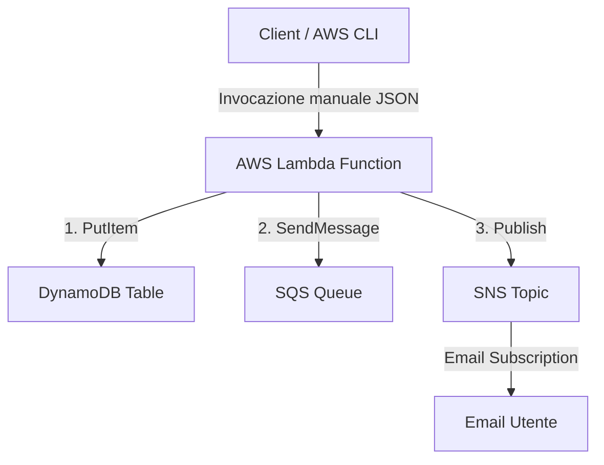

# AWS Esempio 13 - SQS, SNS e DynamoDB Integration

Questo esempio mostra come creare un'architettura Serverless su AWS integrando una Lambda Function (Python 3.11) con i servizi Amazon SQS, Amazon SNS e Amazon DynamoDB utilizzando Terraform.
- ⚠️ **Nota importante**: l'esecuzione di questi esempi nel cloud potrebbe causare costi indesiderati ⚠️

## Architettura



## Funzionamento

1. **Invocazione**: La Lambda viene invocata manualmente passando un payload JSON del tipo:
   ```json
   {
     "message": "Messaggio personalizzato",
     "sender": "AlNao"
   }
   ```
2. **DynamoDB**: La Lambda registra i dettagli dell'invocazione (Request ID, Timestamp, Messaggio, Mittente, Stato) all'interno di una tabella DynamoDB per scopi di auditing.
3. **SQS**: La Lambda invia un messaggio strutturato alla coda SQS contenente il payload ricevuto.
4. **SNS**: La Lambda pubblica una notifica formattata sul Topic SNS, il quale provvede a inoltrarla all'indirizzo email configurato tramite la subscription.

## Risorse Create

- **DynamoDB Table**: Tabella con chiave primaria `id` (Request ID) in modalità Billing `PAY_PER_REQUEST`.
- **SQS Queue**: Coda standard per il buffering o il disaccoppiamento dei messaggi.
- **SNS Topic**: Topic per il fan-out delle notifiche.
- **SNS Subscription**: Registrazione email per ricevere le notifiche (opzionale se valorizzata la variabile).
- **IAM Role e Policy**: Ruolo IAM per consentire alla Lambda di eseguire `dynamodb:PutItem`, `sqs:SendMessage` e `sns:Publish`.
- **Lambda Function**: Codice Python 3.11 pre-impacchettato in formato ZIP.
- **CloudWatch Log Group**: Gruppo di log per il tracciamento dell'esecuzione della Lambda.

## Costi (eu-central-1)

Il costo di esecuzione di questo esempio è praticamente **zero** se si rientra nel Free Tier di AWS:
- **Lambda**: Primi 1M di richieste al mese gratuite.
- **DynamoDB**: Tabelle on-demand (PAY_PER_REQUEST) offrono i primi 25 GB di storage e 25 write/read capacity unit gratis.
- **SQS**: Primo 1M di richieste al mese gratuite.
- **SNS**: Primo 1M di notifiche push/email al mese gratuite.

---

## Comandi per il Deployment

### 1. Inizializzazione e validazione
Crea un file `terraform.tfvars` partendo da `terraform.tfvars.example` per configurare la tua email:
```bash
cp terraform.tfvars.example terraform.tfvars
```
Modifica il file inserendo il tuo indirizzo email nel campo `notification_email`.

Inizializza la directory:
```bash
terraform init
terraform plan
```

### 2. Esecuzione del Deploy
Applica la configurazione:
```bash
terraform apply
```

### 3. Conferma la Subscription SNS
Controlla la casella di posta specificata in `notification_email`. Dovresti ricevere un'email da AWS Notifications con oggetto **"AWS Notification - Subscription Confirmation"**.
Clicca sul link **"Confirm Subscription"** contenuto nell'email per abilitare la ricezione delle notifiche.

---

## Test e Verifica

### 1. Invocazione della Lambda tramite AWS CLI
Recupera il nome della Lambda dagli output di Terraform ed eseguila:
```bash
# Esegui l'invocazione manuale
aws lambda invoke \
  --function-name $(terraform output -raw lambda_function_name) \
  --payload '{"message": "Ciao AlNao! Questo è un test end-to-end con SQS, SNS e DynamoDB.", "sender": "AlNao"}' \
  --cli-binary-format raw-in-base64-out \
  response.json

# Visualizza la risposta
cat response.json
```

### 2. Verifica su DynamoDB
Verifica che la riga sia stata salvata correttamente nella tabella DynamoDB:
```bash
aws dynamodb scan --table-name $(terraform output -raw dynamodb_table_name)
```

### 3. Verifica su SQS
Controlla che la coda contenga il messaggio inviato dalla Lambda. 
Nota: per consumare il messaggio e leggerlo da CLI puoi eseguire una receive-message:
```bash
aws sqs receive-message --queue-url $(terraform output -raw sqs_queue_url)
```

### 4. Verifica Notifica Email
Controlla la tua email per verificare di aver ricevuto la notifica formattata contenente il testo inserito nel payload di invocazione.

---

## Pulizia delle Risorse
Per rimuovere tutte le risorse create ed evitare addebiti:
```bash
terraform destroy
```

---

# &lt; AlNao /&gt;
Tutti i codici sorgente e le informazioni presenti in questo repository sono frutto di un attento e paziente lavoro di sviluppo da parte di AlNao, che si è impegnato a verificarne la correttezza nella massima misura possibile. Qualora parte del codice o dei contenuti sia stato tratto da fonti esterne, la relativa provenienza viene sempre citata, nel rispetto della trasparenza e della proprietà intellettuale. 

Alcuni contenuti e porzioni di codice presenti in questo repository sono stati realizzati anche grazie al supporto di strumenti di intelligenza artificiale, il cui contributo ha permesso di arricchire e velocizzare la produzione del materiale. Ogni informazione e frammento di codice è stato comunque attentamente verificato e validato, con l’obiettivo di garantire la massima qualità e affidabilità dei contenuti offerti. 

Per ulteriori dettagli, approfondimenti o richieste di chiarimento, si invita a consultare il sito [AlNao.it](https://www.alnao.it/).

## License
Made with ❤️ by <a href="https://www.alnao.it">AlNao</a>
&bull; 
Public projects 
<a href="https://www.gnu.org/licenses/gpl-3.0"  valign="middle"> </a>
*Free Software!*

Il software è distribuito secondo i termini della GNU General Public License v3.0. L'uso, la modifica e la ridistribuzione sono consentiti, a condizione che ogni copia o lavoro derivato sia rilasciato con la stessa licenza. Il contenuto è fornito "così com'è", senza alcuna garanzia, esplicita o implicita.
