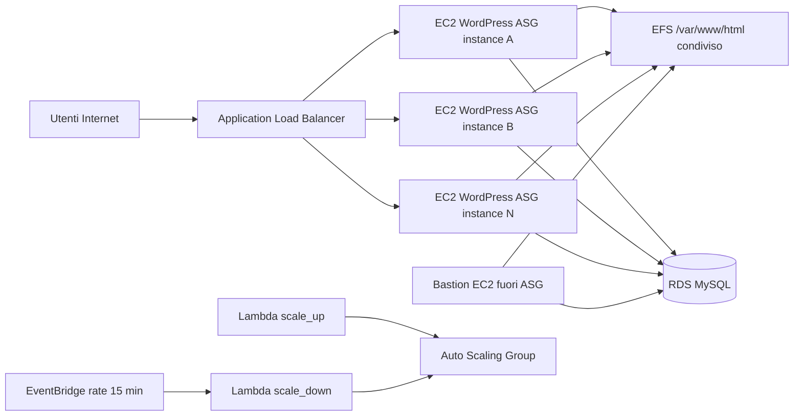

# AWS Esempio 15 - WordPress Scaling con ALB + ASG + EFS + RDS + Bastion

Questo esempio realizza una piattaforma WordPress scalabile su AWS con:
- **Application Load Balancer (ALB)** pubblico
- **HTTPS opzionale** con ACM e redirect HTTP -> HTTPS
- **Auto Scaling Group (ASG)** con default 2 istanze, max 4
- **Amazon EFS** condiviso per file WordPress (`/var/www/html`)
- **Amazon RDS MySQL** condiviso da tutte le istanze
- **Bastion EC2** fuori dallo scaling, usata per bootstrap/gestione WordPress su EFS+RDS
- **2 Lambda** per scaling temporaneo:
  - `scale_up`: aumenta la capacita per un numero di ore
  - `scale_down`: riporta la capacita al valore base alla scadenza
- ⚠️ Nota importante: l'esecuzione di questi esempi nel cloud puo causare costi indesiderati ⚠️

## Architettura



## Risorse Create

1. **Networking (default VPC)**
- VPC di default
- Subnet di default

2. **Security Groups**
- ALB: ingress `80` e `443` da `allowed_http_cidr`
- ASG WordPress: ingress `80` solo da ALB
- Bastion: ingress `22` da `allowed_ssh_cidr`
- EFS: ingress `2049` da ASG + Bastion
- RDS: ingress `3306` da ASG + Bastion

3. **WordPress Data Layer**
- EFS encrypted + mount target su tutte le subnet di default
- RDS MySQL 8.0 (`db.t3.micro` default), con opzione `rds_multi_az`

4. **Compute Layer**
- Launch Template WordPress (Apache/PHP + mount EFS + setup `wp-config.php`)
- ASG con default `2` istanze (min `2`, max `4`)
- Bastion EC2 separata con stesso mount EFS e connessione RDS

5. **Traffic Layer**
- ALB pubblico + listener HTTP `80`
- Listener HTTPS `443` opzionale (ACM)
- Redirect HTTP -> HTTPS quando HTTPS e abilitato
- Target Group con health check su `/`

6. **Scaling**
- Target Tracking su:
  - CPU media ASG (`ASGAverageCPUUtilization`)
  - Richieste ALB per target (`ALBRequestCountPerTarget`)
- Lambda `scale_up` per incremento temporaneo
- Lambda `scale_down` eseguita da EventBridge ogni 15 minuti

## Prerequisiti

1. Terraform >= 1.0
2. Credenziali AWS configurate
3. Permessi IAM su EC2, ASG, ALB, EFS, RDS, Lambda, CloudWatch/EventBridge, IAM, SSM
4. (Opzionale) Key pair EC2 per SSH sulla bastion

## Struttura

```
AWS-Esempio15-WordpressScaling/
├── backend.tf
├── main.tf
├── variables.tf
├── outputs.tf
├── terraform.tfvars.example
├── terraform.tfvars.lab.example
├── README.md
└── lambda_functions/
    ├── scale_up.py
    └── scale_down.py
```

## Deploy

```bash
cd AWS-Esempio15-WordpressScaling
cp terraform.tfvars.example terraform.tfvars
terraform init
terraform plan
terraform apply
```

Per un profilo laboratorio a costo ridotto:

```bash
cp terraform.tfvars.lab.example terraform.tfvars
terraform init
terraform plan
terraform apply
```

A deploy completato:

```bash
terraform output wordpress_url
terraform output bastion_public_ip
```

Apri il valore `wordpress_url` nel browser e completa il wizard WordPress.

## Collegarsi al bastion

Prerequisiti:
- Hai impostato `key_name` in `terraform.tfvars` con una key pair EC2 esistente.
- Hai la chiave privata locale corrispondente (es. `~/.ssh/mia-key.pem`).
- Il tuo IP pubblico e' incluso in `allowed_ssh_cidr`.

1. Recupera l'IP pubblico della bastion:

```bash
terraform output -raw bastion_public_ip
```

2. Imposta permessi corretti sulla chiave privata:

```bash
chmod 400 ~/.ssh/mia-key.pem
```

3. Collegati in SSH alla bastion (utente Amazon Linux 2 = `ec2-user`):

```bash
ssh -i ~/.aws/2025_alberto-nao-francoforte.pem ec2-user@$(terraform output -raw bastion_public_ip)
```

4. Verifiche utili una volta dentro la bastion:

```bash
# Verifica mount EFS
df -h | grep /var/www/html

# Verifica Apache
sudo systemctl status httpd --no-pager

# Verifica connettivita MySQL verso RDS
MYSQL_HOST="$(terraform output -raw rds_endpoint)"
timeout 5 bash -c "</dev/tcp/${MYSQL_HOST}/3306" && echo "RDS raggiungibile" || echo "RDS non raggiungibile"
```

Alternativa senza output Terraform (via AWS CLI):

```bash
aws ec2 describe-instances \
  --filters "Name=tag:Name,Values=*bastion*" "Name=instance-state-name,Values=running" \
  --query "Reservations[].Instances[].PublicIpAddress" \
  --output text
```


## HTTPS con ACM (Step 1)

1. Crea/valida un certificato in ACM nella stessa regione dell'ALB.
2. Inserisci in `terraform.tfvars`:

```hcl
enable_https        = true
acm_certificate_arn = "arn:aws:acm:eu-central-1:123456789012:certificate/xxxxxxxx-xxxx-xxxx-xxxx-xxxxxxxxxxxx"
```

Con questa impostazione:
- listener `443` attivo con TLS policy moderna
- listener `80` in redirect `301` verso `https`

## Variabili Principali

| Variabile | Default | Descrizione |
|---|---|---|
| `region` | `eu-central-1` | Regione AWS |
| `instance_type` | `t3.micro` | Tipo EC2 bastion + ASG |
| `asg_min_size` | `2` | Min istanze ASG |
| `asg_desired_capacity` | `2` | Desired iniziale ASG |
| `asg_max_size` | `4` | Max istanze ASG |
| `cpu_target_value` | `55` | Target CPU scaling |
| `alb_request_target_value` | `500` | Target richieste per target |
| `temporary_desired_capacity` | `3` | Desired temporaneo per lambda scale-up |
| `temporary_duration_hours` | `4` | Durata ore del boost temporaneo |
| `db_instance_class` | `db.t3.micro` | Classe RDS |
| `allowed_http_cidr` | `0.0.0.0/0` | Accesso HTTP ALB |
| `allowed_ssh_cidr` | `0.0.0.0/0` | Accesso SSH bastion |
| `enable_https` | `false` | Abilita HTTPS + redirect HTTP |
| `acm_certificate_arn` | `""` | ARN certificato ACM |
| `rds_multi_az` | `false` | RDS HA su due AZ |
| `rds_backup_retention_period` | `0` | Giorni retention backup RDS |
| `rds_deletion_protection` | `false` | Protezione cancellazione RDS |

## Uso Lambda Scaling Temporaneo

Per aumentare temporaneamente la capacita (esempio: da 2 a 3 per 4 ore):

```bash
aws lambda invoke \
  --function-name "$(terraform output -raw lambda_scale_up_name)" \
  --payload '{}' \
  --cli-binary-format raw-in-base64-out \
  /tmp/scale_up_result.json
cat /tmp/scale_up_result.json
```

La lambda `scale_down` gira automaticamente ogni 15 minuti e, quando scade il timer, riporta il desired capacity al valore base (`asg_desired_capacity`).

Invoke manuale (debug):

```bash
aws lambda invoke \
  --function-name "$(terraform output -raw lambda_scale_down_name)" \
  --payload '{}' \
  --cli-binary-format raw-in-base64-out \
  /tmp/scale_down_result.json
cat /tmp/scale_down_result.json
```

## Costi Stimati (Tabella)

Stime indicative per `eu-central-1`, 24/7, no free-tier, no sconti riservati, no tasse.
I prezzi reali variano nel tempo e in base a traffico, storage e politiche AWS.

### Scenario Base Default (2 ASG + 1 bastion + RDS single-AZ + EFS 10GB)

| Componente | Quantita/Taglia | Costo mensile indicativo (USD) | Include nel costo idle? |
|---|---|---:|---|
| EC2 ASG + Bastion | 3 x t3.micro | 26 - 30 | Si |
| RDS MySQL compute | db.t3.micro single-AZ | 15 - 22 | Si |
| RDS storage | 20GB gp | 2 - 3 | Si |
| ALB (ore base) | 1 ALB | 16 - 20 | Si |
| ALB LCU variabili | richieste/connessioni/process bytes | 0 - 25 | No (quasi 0 in idle) |
| EFS Standard | 10GB | 3 - 4 | Si |
| Lambda + EventBridge + Logs | basso volume | 0 - 1 | Quasi si |
| Data Transfer Internet | traffico uscita | 0 - variabile | No |

### Totale Scenario Base

| Tipo totale | Stima mensile indicativa (USD) | Note |
|---|---:|---|
| Solo infrastruttura accesa (idle, senza utenti) | 62 - 80 | ALB LCU e data transfer quasi nulli |
| Infrastruttura con traffico moderato | 75 - 110 | cresce soprattutto ALB LCU + data transfer |

### Scenario Picco (4 ASG + 1 bastion)

| Voce | Base (2 ASG + bastion) | Picco (4 ASG + bastion) | Delta indicativo |
|---|---:|---:|---:|
| EC2 totali | 3 x t3.micro | 5 x t3.micro | +17 - 20 |
| Altri costi fissi (RDS/EFS/ALB base) | simili | simili | ~0 |
| Costi variabili (ALB LCU, transfer, EFS I/O) | medi | piu alti | dipende dal carico |

### Impatto Multi-AZ su RDS

| Opzione RDS | Costo compute DB indicativo (USD/mese) | Considerazione |
|---|---:|---|
| Single-AZ | 15 - 22 | migliore per lab/costo |
| Multi-AZ | 30 - 44 | piu resilienza, costo piu alto |

## Note di Produzione

Configurazione pensata per laboratorio/demo. Per produzione valuta:
- HTTPS con ACM + listener 443
- subnet private per ASG e RDS
- NAT Gateway o VPC endpoints adeguati
- Secrets Manager per password DB
- RDS Multi-AZ e backup retention > 0
- WAF davanti ad ALB
- hardening OS e patch management

## Ipotesi: MySQL su EC2 mini al posto di RDS

Si puo fare tecnicamente, ma per questo scenario WordPress con scaling non lo consiglio salvo laboratorio estremo.

Vantaggi principali:
- costo potenzialmente minore nel breve (es. `t3.micro`)
- controllo totale su OS/MySQL

Svantaggi importanti:
- niente HA gestita: failover, patching, backup, monitoraggio e restore sono a carico tuo
- rischio maggiore di downtime/corruzione in caso di problemi disco/istanza
- piu complesso da mettere in sicurezza e mantenere
- quando il traffico cresce diventa il collo di bottiglia prima del layer web

Ordine di grandezza costi (solo database):
- RDS `db.t3.micro` single-AZ: ~`$15-22/mese` + storage
- EC2 `t3.micro` + EBS (20GB): ~`$10-14/mese` circa

Differenza tipica: risparmio **limitato** (spesso 5-10 USD/mese) a fronte di perdita netta di affidabilita operativa.

Conclusione pratica:
- **Lab/POC personale**: EC2 MySQL puo andare, se accetti rischio e manutenzione manuale.
- **Produzione o demo affidabile**: meglio RDS (idealmente Multi-AZ quando il budget lo consente).

## Cleanup

```bash
terraform destroy
```


# < AlNao />
Tutti i codici sorgente e le informazioni presenti in questo repository sono frutto di un attento e paziente lavoro di sviluppo da parte di AlNao, che si e impegnato a verificarne la correttezza nella massima misura possibile. Qualora parte del codice o dei contenuti sia stato tratto da fonti esterne, la relativa provenienza viene sempre citata, nel rispetto della trasparenza e della proprieta intellettuale.

Alcuni contenuti e porzioni di codice presenti in questo repository sono stati realizzati anche grazie al supporto di strumenti di intelligenza artificiale, il cui contributo ha permesso di arricchire e velocizzare la produzione del materiale. Ogni informazione e frammento di codice e stato comunque attentamente verificato e validato, con l'obiettivo di garantire la massima qualita e affidabilita dei contenuti offerti.

Per ulteriori dettagli, approfondimenti o richieste di chiarimento, si invita a consultare il sito [AlNao.it](https://www.alnao.it/).

## License
Made with ❤️ by <a href="https://www.alnao.it">AlNao</a>
&bull;
Public projects
<a href="https://www.gnu.org/licenses/gpl-3.0"  valign="middle"> </a>
*Free Software!*

Il software e distribuito secondo i termini della GNU General Public License v3.0. L'uso, la modifica e la ridistribuzione sono consentiti, a condizione che ogni copia o lavoro derivato sia rilasciato con la stessa licenza. Il contenuto e fornito "cosi com'e", senza alcuna garanzia, esplicita o implicita.
