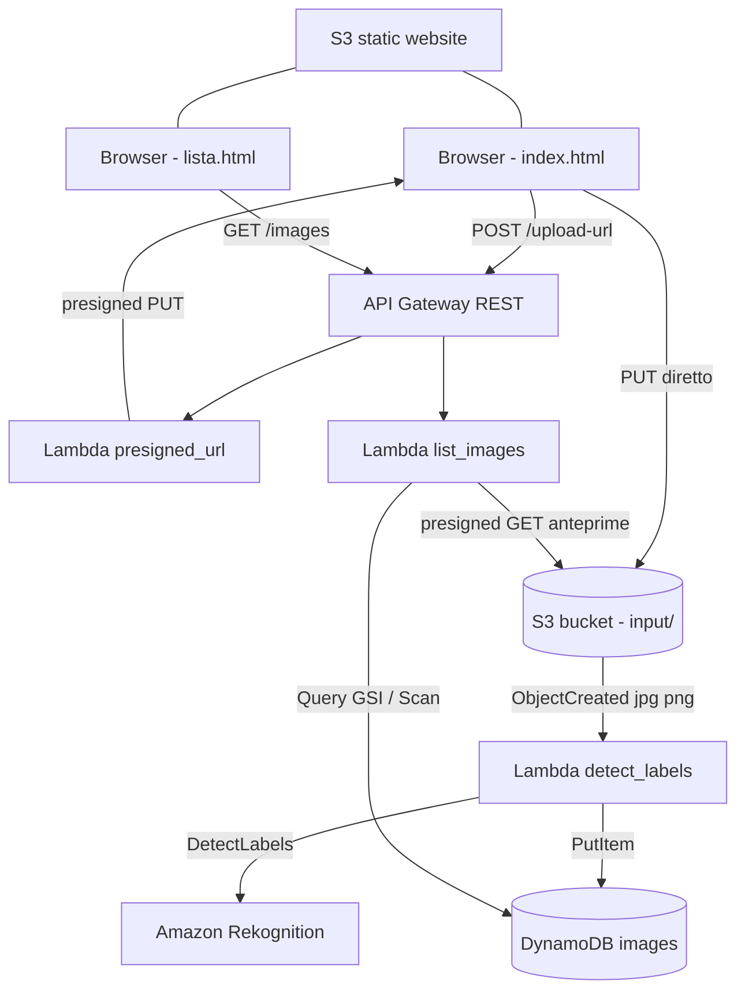

# AWS Esempio 16 - Rekognition Image Detector

Applicazione serverless che analizza le immagini con **Amazon Rekognition**:
ogni file caricato nella cartella `input/` di un bucket S3 fa partire una Lambda che chiede a
Rekognition l'elenco degli elementi presenti nell'immagine, salva tutte le label su DynamoDB e
marca la riga con il campo **`immagine_rilevante`** quando fra gli elementi riconosciuti compare
una parola chiave parametrica (default `airplane`).

Sono incluse una **API REST** con due endpoint e due **pagine web Bootstrap** ospitate su S3:
una per caricare l'immagine e una per consultare la tabella con il filtro sulle sole immagini
rilevanti. Il **CORS e' aperto** su bucket S3, API Gateway e risposte Lambda.

- ⚠️ Nota importante: l'esecuzione di questi esempi nel cloud puo causare costi indesiderati ⚠️

## Architettura



Il file dell'immagine **non passa mai da API Gateway**: il browser riceve un presigned URL e fa
la `PUT` direttamente su S3, quindi non ci sono limiti di payload da rispettare.

## Risorse Create

1. **Storage**
   - Bucket S3 immagini, privato, con CORS (`PUT`, `GET`, `HEAD`) e notifica verso Lambda su `input/*.jpg|jpeg|png`
   - Bucket S3 sito statico, pubblico in sola lettura, con `index.html`, `lista.html` e `config.js`

2. **Database**
   - Tabella DynamoDB `PAY_PER_REQUEST` con hash key `image_key`
   - GSI `RilevanteIndex` (`immagine_rilevante` + `upload_timestamp`) per il filtro sulle rilevanti

3. **Compute**
   | Lambda | Trigger | Descrizione |
   |---|---|---|
   | `detect_labels` | S3 `ObjectCreated` su `input/` | Chiama Rekognition `DetectLabels`, valuta la parola chiave, scrive su DynamoDB |
   | `presigned_url` | `POST /upload-url` | Genera il presigned URL `PUT` per l'upload da browser |
   | `list_images` | `GET /images` | Legge DynamoDB (Query sul GSI o Scan) e aggiunge le anteprime firmate |

4. **API**
   - API Gateway REST regionale, stage `prod`, integrazioni `AWS_PROXY`
   - `POST /upload-url`, `GET /images?rilevanti=true&limit=100`
   - Metodi `OPTIONS` MOCK su entrambe le resource per il preflight CORS

5. **IAM e Log**
   - Un ruolo Lambda con policy separate per S3, DynamoDB e Rekognition
   - Log group CloudWatch dedicati per le tre Lambda e per API Gateway

## Prerequisiti

1. Terraform >= 1.0
2. Credenziali AWS configurate (`aws configure`)
3. Permessi IAM su: S3, Lambda, DynamoDB, API Gateway, Rekognition, IAM, CloudWatch
4. Region con Rekognition disponibile (`eu-central-1` lo e')
5. Il **Block Public Access a livello di account** deve essere disattivato, altrimenti il bucket del sito statico non puo' diventare pubblico

## Struttura

```
AWS-Esempio16-RekognitionImageDetector/
├── backend.tf              # stato remoto su S3
├── main.tf                 # provider, locals, log group CloudWatch
├── variables.tf
├── s3.tf                   # bucket immagini, CORS, notifica verso Lambda
├── dynamodb.tf             # tabella + GSI RilevanteIndex
├── iam.tf                  # ruolo e policy delle Lambda
├── lambda.tf               # archivi ZIP e tre Lambda
├── api_gateway.tf          # REST API, resource, deployment, stage
├── api_gateway_cors.tf     # metodi OPTIONS per il preflight
├── website.tf              # bucket sito statico e upload delle pagine
├── outputs.tf
├── terraform.tfvars.example
├── README.md
├── lambda_functions/
│   ├── utils.py            # risposte API con CORS, validazione nome file
│   ├── detect_labels.py
│   ├── presigned_url.py
│   └── list_images.py
└── website/
    ├── index.html          # pagina di upload
    ├── lista.html          # tabella con filtro sulle rilevanti
    └── config.js.tpl       # template con l'URL delle API, reso da Terraform
```

## Deploy

```bash
cd AWS-Esempio16-RekognitionImageDetector
cp terraform.tfvars.example terraform.tfvars
terraform init
terraform plan
terraform apply
```

A deploy completato:

```bash
terraform output website_url
terraform output api_endpoint
```

Nota: `config.js` viene generato da Terraform con l'URL reale dello stage, quindi le pagine
non contengono nessun endpoint scritto a mano.

## Test da browser

1. Apri il valore di `terraform output website_url`
2. Nella pagina **Carica immagine** scegli una foto `.jpg` o `.png` con un aereo e premi *Carica e analizza*
3. Dopo qualche secondo apri **Immagini analizzate**: la riga compare con il badge verde `RILEVANTE` e l'elenco degli elementi riconosciuti con la percentuale di confidenza
4. Ripeti con una foto senza aerei: la riga compare con il badge grigio `no`
5. Attiva lo switch *Solo rilevanti* per vedere solo le immagini che contengono la parola chiave

## Test da riga di comando

```bash
BUCKET=$(terraform output -raw bucket_name)
API=$(terraform output -raw api_endpoint)

# 1. Carica una immagine (fa partire l'analisi)
aws s3 cp ./aereo.jpg s3://$BUCKET/input/

# 2. Log della lambda di analisi
aws logs tail /aws/lambda/$(terraform output -raw lambda_detect_labels_name) --follow

# 3. Contenuto della tabella
aws dynamodb scan --table-name $(terraform output -raw table_name)

# 4. API: elenco completo e solo rilevanti
curl -s "$API/images" | jq
curl -s "$API/images?rilevanti=true" | jq

# 5. Presigned URL via API
curl -s -X POST "$API/upload-url" \
  -H 'Content-Type: application/json' \
  -d '{"filename":"aereo.jpg","content_type":"image/jpeg"}' | jq

# 6. Verifica del preflight CORS
curl -i -X OPTIONS "$API/upload-url"
```

Gli stessi comandi sono disponibili gia' compilati negli output `test_upload_cli`,
`test_list_all`, `test_list_rilevanti`, `test_cors_preflight` e `test_logs`.

## Variabili Principali

| Variabile | Default | Descrizione |
|---|---|---|
| `region` | `eu-central-1` | Regione AWS |
| `project_name` | `alnao-dev-terraform-esempio16-rekognition` | Prefisso di tutte le risorse |
| `keyword_rilevante` | `airplane` | Parola chiave che marca l'immagine come rilevante |
| `min_confidence` | `75` | Confidenza minima delle label restituite da Rekognition |
| `max_labels` | `15` | Numero massimo di label per immagine |
| `input_prefix` | `input/` | Cartella del bucket monitorata dalla Lambda |
| `presigned_expiration` | `3600` | Durata in secondi del presigned URL di upload |
| `cors_allowed_origins` | `["*"]` | Origini ammesse per CORS |
| `stage_name` | `prod` | Stage di API Gateway |
| `log_retention_days` | `7` | Retention dei log CloudWatch |
| `force_destroy` | `true` | Permette il destroy dei bucket con oggetti dentro |

Per cambiare la parola chiave basta modificare `terraform.tfvars` e rilanciare `terraform apply`:
la variabile viene passata come variabile d'ambiente alle Lambda, non serve toccare il codice.
Le immagini gia' analizzate mantengono pero' la valutazione fatta con la keyword precedente.

## Modello dati DynamoDB

| Campo | Tipo | Descrizione |
|---|---|---|
| `image_key` | S (hash key) | Chiave S3 completa, es. `input/aereo.jpg` |
| `upload_timestamp` | S | Data/ora ISO8601 dell'analisi (range key del GSI) |
| `immagine_rilevante` | S | `SI` / `NO` (hash key del GSI) |
| `labels` | L | Lista di `{ name, confidence }` |
| `labels_csv` | S | Stesse label in formato leggibile |
| `keyword` | S | Parola chiave usata nella valutazione |
| `keyword_confidence` | N | Confidenza della label che ha fatto scattare il flag |
| `bucket` | S | Bucket di provenienza |
| `size_bytes` | N | Dimensione del file |

`immagine_rilevante` e' una stringa e non un booleano perche' DynamoDB non permette di
indicizzare attributi di tipo `BOOL`.

## Note sul CORS

Il CORS e' aperto su tre livelli, tutti necessari:

1. **Bucket S3 immagini** (`aws_s3_bucket_cors_configuration`): senza questo il browser blocca la `PUT` verso il presigned URL e il caricamento delle anteprime
2. **API Gateway**: metodi `OPTIONS` MOCK che rispondono al preflight con gli header `Access-Control-Allow-*`
3. **Risposte Lambda** (`api_response` in `lambda_functions/utils.py`): gli `OPTIONS` coprono solo il preflight, le risposte reali devono portare gli header per conto loro

I metodi `OPTIONS` sono inclusi nel trigger di redeployment di `aws_api_gateway_deployment`:
senza di essi una modifica al solo CORS non verrebbe mai pubblicata sullo stage.

## Costi Stimati

Stime indicative per `eu-central-1`, uso da laboratorio.

| Componente | Unita' | Costo indicativo (USD) |
|---|---|---:|
| Rekognition `DetectLabels` | 1.000 immagini | ~1,00 |
| Lambda | 10.000 invocazioni brevi | < 0,05 |
| DynamoDB on-demand | 10.000 scritture + 10.000 letture | < 0,05 |
| S3 storage | 1 GB/mese | ~0,02 |
| API Gateway REST | 10.000 richieste | ~0,04 |
| CloudWatch Logs | pochi MB | < 0,10 |

In pratica, con qualche decina di immagini di prova il costo mensile resta sotto il dollaro.
La voce che cresce piu' in fretta e' Rekognition, che si paga a immagine analizzata.

## Troubleshooting

| Sintomo | Causa probabile | Soluzione |
|---|---|---|
| La pagina non si apre / `403` sul sito | Block Public Access attivo a livello di account | Disattivarlo dalla console S3, poi `terraform apply` |
| Errore CORS sulla `PUT` verso S3 | `cors_allowed_origins` non comprende l'origine del sito | Lasciare `["*"]` oppure inserire l'URL del sito |
| L'immagine si carica ma la riga non compare | Estensione diversa da `.jpg`, `.jpeg`, `.png` oppure file caricato fuori da `input/` | Usare i formati supportati e la cartella corretta |
| `InvalidImageFormatException` nei log | File non e' realmente JPEG/PNG (estensione rinominata) | Convertire l'immagine in un formato valido |
| Tutte le immagini risultano non rilevanti | `min_confidence` troppo alto o keyword non presente fra le label | Abbassare `min_confidence`, aumentare `max_labels`, verificare con `aws dynamodb scan` le label effettive |
| Il presigned URL scade | `presigned_expiration` troppo basso | Aumentare il valore e rifare `apply` |

## Cleanup

```bash
terraform destroy
```

I bucket hanno `force_destroy = true`, quindi vengono cancellati anche con le immagini dentro.


# &lt; AlNao /&gt;
Tutti i codici sorgente e le informazioni presenti in questo repository sono frutto di un attento e paziente lavoro di sviluppo da parte di AlNao, che si è impegnato a verificarne la correttezza nella massima misura possibile. Qualora parte del codice o dei contenuti sia stato tratto da fonti esterne, la relativa provenienza viene sempre citata, nel rispetto della trasparenza e della proprietà intellettuale. 


Alcuni contenuti e porzioni di codice presenti in questo repository sono stati realizzati anche grazie al supporto di strumenti di intelligenza artificiale, il cui contributo ha permesso di arricchire e velocizzare la produzione del materiale. Ogni informazione e frammento di codice è stato comunque attentamente verificato e validato, con l’obiettivo di garantire la massima qualità e affidabilità dei contenuti offerti. 


Per ulteriori dettagli, approfondimenti o richieste di chiarimento, si invita a consultare il sito [AlNao.it](https://www.alnao.it/).


## License
Made with ❤️ by <a href="https://www.alnao.it">AlNao</a>
&bull; 
Public projects 
<a href="https://www.gnu.org/licenses/gpl-3.0"  valign="middle"> </a>
*Free Software!*


Il software è distribuito secondo i termini della GNU General Public License v3.0. L'uso, la modifica e la ridistribuzione sono consentiti, a condizione che ogni copia o lavoro derivato sia rilasciato con la stessa licenza. Il contenuto è fornito "così com'è", senza alcuna garanzia, esplicita o implicita.


The software is distributed under the terms of the GNU General Public License v3.0. Use, modification, and redistribution are permitted, provided that any copy or derivative work is released under the same license. The content is provided "as is", without any warranty, express or implied.


