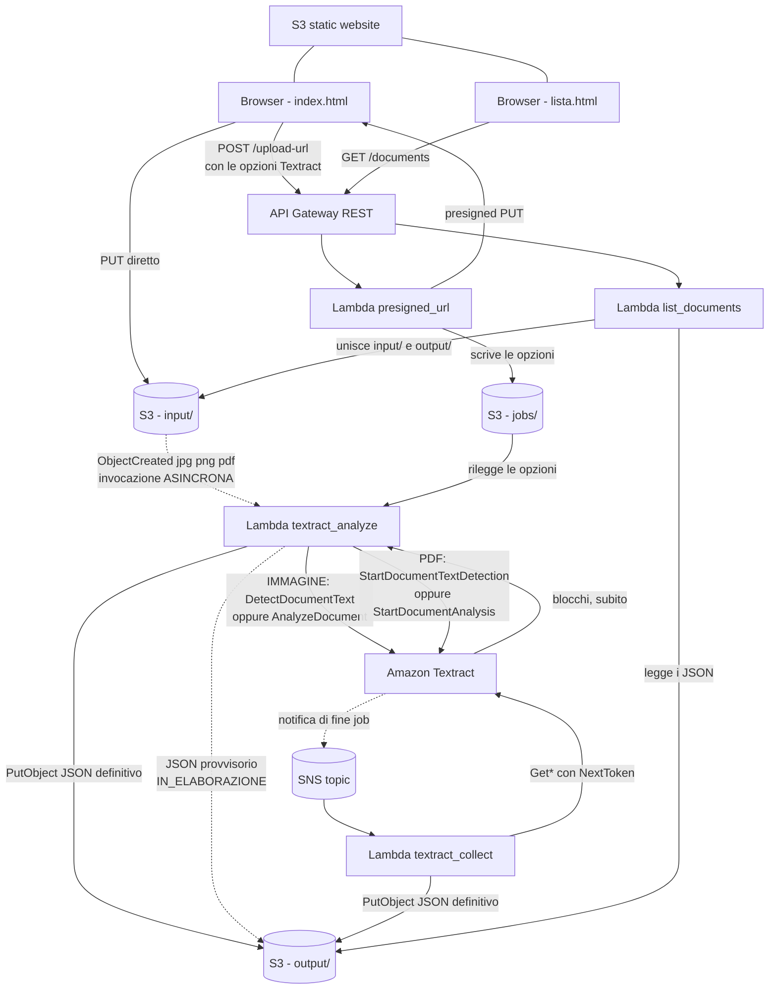

# AWS Esempio 17 - Textract Document Reader

Applicazione serverless che estrae il testo da immagini e PDF con **Amazon Textract**:
ogni file caricato nella cartella `input/` di un bucket S3 fa partire una Lambda **asincrona** che
chiama Textract e salva in `output/` un **JSON con il nome del file e tutto il testo riconosciuto**.

Sono supportati due tipi di documento, che seguono due strade diverse dentro Textract:
**immagini** `.jpg` / `.jpeg` / `.png` (operazioni sincrone, risultato in pochi secondi) e
**PDF anche multipagina** (operazioni asincrone `Start*` / `Get*` con notifica su SNS).

Al momento dell'upload si sceglie *cosa* deve estrarre Textract: solo il testo, oppure anche
**tabelle** (`TABLES`), **campi di un modulo** (`FORMS`), **firme** (`SIGNATURES`), **layout**
(`LAYOUT`) e **domande specifiche sul documento** (`QUERIES`, per esempio *"Qual e' l'importo
totale?"*). Le opzioni scelte viaggiano insieme al file e vengono rilette dalla Lambda.

Sono incluse una **API REST** con due endpoint e due **pagine web Bootstrap** ospitate su S3: una
per caricare il documento con le sue opzioni e una per consultare l'elenco dei file caricati con il
contenuto del JSON quando e' pronto. Il **CORS e' aperto** su bucket S3, API Gateway e risposte Lambda.

- ⚠️ Nota importante: l'esecuzione di questi esempi nel cloud puo causare costi indesiderati ⚠️

## Architettura



Due cose rendono il flusso completamente asincrono:

1. Il file dell'immagine **non passa mai da API Gateway**: il browser riceve un presigned URL e fa
   la `PUT` direttamente su S3, quindi non ci sono limiti di payload da rispettare.
2. Il browser **non aspetta Textract**: dopo l'upload la pagina torna subito libera, la Lambda parte
   da sola sull'evento S3 e la pagina di elenco si aggiorna da sola quando il JSON compare.

Sui PDF c'e' un terzo livello di asincronia: nemmeno la Lambda aspetta Textract. Avvia il job,
scrive un JSON provvisorio e termina; sara' una seconda Lambda, svegliata da SNS, a raccogliere
il risultato.

## Come viaggiano le opzioni Textract

Le opzioni scelte nella pagina di upload (feature, query, soglia di confidenza) devono arrivare a
una Lambda che verra' invocata **piu' tardi**, da un evento S3 che non le conosce. La soluzione
adottata e' un piccolo file JSON di appoggio:

1. `presigned_url` valida le opzioni e le scrive in `jobs/<nome file>.json`
2. **solo dopo** restituisce il presigned URL al browser
3. quando l'immagine arriva, `textract_analyze` rilegge `jobs/<nome file>.json`

L'ordine dei primi due passi elimina ogni corsa critica: il file con le opzioni e' gia' al suo posto
prima che l'immagine possa esistere. Se il file manca (immagine copiata con `aws s3 cp`, quindi
senza passare dalla pagina web) si usano i default definiti in `terraform.tfvars`, e l'analisi parte
lo stesso. Un `lifecycle rule` cancella i file di `jobs/` dopo `jobs_expiration_days` giorni.

**Perche' non i metadata dell'oggetto S3?** I metadata utente sono limitati a 2 KB e devono essere
US-ASCII: un elenco di query in italiano li farebbe saltare. In piu' con un presigned URL il browser
dovrebbe rispedire esattamente gli stessi header `x-amz-meta-*` usati per la firma, pena
`SignatureDoesNotMatch`.

## Quale operazione Textract viene chiamata

La scelta dipende da **due** cose: il tipo di file (che decide fra via sincrona e asincrona) e le
feature richieste (che decidono fra sola estrazione del testo e analisi strutturata).

| Tipo di file | Nessuna feature | Una o piu' feature |
|---|---|---|
| Immagine `.jpg` `.jpeg` `.png` | `DetectDocumentText` | `AnalyzeDocument` |
| PDF `.pdf` | `StartDocumentTextDetection` | `StartDocumentAnalysis` |

| Feature | A cosa serve |
|---|---|
| `TABLES` | ricostruisce le tabelle riga per riga, incluse celle unite e righe di intestazione |
| `FORMS` | coppie chiave/valore dei moduli e stato delle caselle di spunta |
| `QUERIES` | risponde a domande in linguaggio naturale poste sul documento (max 15) |
| `SIGNATURES` | posizione e confidenza delle firme |
| `LAYOUT` | titoli, paragrafi, elenchi, intestazioni, numeri di pagina |

Le feature sono le stesse nelle due modalita': cambia solo *come* si ottiene il risultato.

### Via sincrona - immagini

`DetectDocumentText` / `AnalyzeDocument` restituiscono i blocchi nella stessa chiamata. La Lambda
`textract_analyze` fa tutto da sola e scrive subito il JSON definitivo. Limiti: **una sola pagina**
e **10 MB**.

### Via asincrona - PDF

Un PDF puo' avere molte pagine, quindi le operazioni sincrone non sono utilizzabili. Il percorso e':

1. `textract_analyze` chiama `StartDocumentAnalysis` (o `StartDocumentTextDetection`) passando un
   **NotificationChannel**: il topic SNS e il ruolo IAM che Textract deve assumere per pubblicarci sopra
2. Textract risponde subito con un `JobId` e la Lambda termina, dopo aver scritto un JSON
   provvisorio con `stato: "IN_ELABORAZIONE"`
3. quando il job finisce, Textract pubblica un messaggio sul topic SNS
4. il topic invoca `textract_collect`, che dal messaggio ricava la key del documento, rilegge le
   opzioni da `jobs/` e scarica i blocchi con `GetDocumentAnalysis`
5. i blocchi arrivano a gruppi di 1.000: si segue il `NextToken` finche' non finiscono, poi si
   sovrascrive il JSON con quello definitivo

Limiti della via asincrona: **3.000 pagine** e **500 MB** (qui `max_pdf_mb` tiene il default a 100 MB,
perche' Textract si paga a pagina).

**Perche' Textract ha bisogno di un ruolo IAM.** Non pubblica su SNS con i permessi di chi lo ha
invocato: assume il ruolo indicato in `NotificationChannel.RoleArn`. Per questo `sns.tf` crea un
ruolo con trust policy su `textract.amazonaws.com` e la Lambda ha `iam:PassRole` su quel ruolo -
senza, la `Start*` fallisce con `AccessDeniedException`.

**Idempotenza.** L'avvio del job usa un `ClientRequestToken` derivato da key + ETag dell'oggetto S3.
Se l'invocazione asincrona della Lambda viene ritentata, Textract riconosce il token e non avvia un
secondo job: senza questo accorgimento un retry rianalizzerebbe - e rifatturerebbe - l'intero PDF.

## Risorse Create

1. **Storage**
   - Bucket S3 dei documenti, privato, con CORS (`PUT`, `GET`, `HEAD`) e notifica verso Lambda su `input/*.jpg|jpeg|png|pdf`. Quattro aree: `input/`, `output/`, `output-raw/`, `jobs/`
   - Lifecycle rule che scade i file di opzioni sotto `jobs/`
   - Bucket S3 sito statico, pubblico in sola lettura, con `index.html`, `lista.html` e `config.js`

2. **Compute**
   | Lambda | Trigger | Descrizione |
   |---|---|---|
   | `presigned_url` | `POST /upload-url` | Valida le opzioni Textract, le salva sotto `jobs/` e genera il presigned URL `PUT` |
   | `textract_analyze` | S3 `ObjectCreated` su `input/` (asincrono) | Immagini: chiama Textract e salva il JSON. PDF: avvia il job asincrono e scrive un JSON provvisorio |
   | `textract_collect` | Notifica SNS di fine job (solo PDF) | Scarica i blocchi con `Get*` seguendo i `NextToken` e scrive il JSON definitivo |
   | `list_documents` | `GET /documents` | Unisce i file di `input/` con i JSON di `output/` e firma le anteprime |

3. **Notifiche**
   - Topic SNS su cui Textract pubblica la fine dei job asincroni
   - Ruolo IAM assunto da Textract per poter pubblicare sul topic
   - Subscription del topic verso `textract_collect` e relativa `aws_lambda_permission`

4. **API**
   - API Gateway REST regionale, stage `prod`, integrazioni `AWS_PROXY`
   - `POST /upload-url`, `GET /documents?limit=100&stato=completati&q=...&key=...`
   - Metodi `OPTIONS` MOCK su entrambe le resource per il preflight CORS

5. **IAM e Log**
   - Un ruolo Lambda con policy separate per S3 e Textract (sincrone, asincrone e `iam:PassRole`)
   - Log group CloudWatch dedicati per le quattro Lambda e per API Gateway
   - `aws_lambda_function_event_invoke_config` per limitare i retry asincroni

**Nota**: a differenza dell'[Esempio 16](../AWS-Esempio16-RekognitionImageDetector/) qui **non c'e'
DynamoDB**. Lo stato di ogni documento e' dato dalla semplice presenza del suo JSON in `output/`:
se manca, l'analisi e' ancora in corso.

## Prerequisiti

1. Terraform >= 1.0
2. Credenziali AWS configurate (`aws configure`)
3. Permessi IAM su: S3, Lambda, API Gateway, Textract, SNS, IAM, CloudWatch
4. Region con Textract disponibile (`eu-central-1` lo e', ma non tutte le region lo sono)
5. Il **Block Public Access a livello di account** deve essere disattivato, altrimenti il bucket del sito statico non puo' diventare pubblico

## Struttura

```
AWS-Esempio17-Textract/
├── backend.tf              # stato remoto su S3
├── main.tf                 # provider, locals, log group CloudWatch
├── variables.tf
├── s3.tf                   # bucket documenti, CORS, lifecycle, notifica verso Lambda
├── iam.tf                  # ruolo e policy delle Lambda
├── sns.tf                  # topic di fine job, ruolo assunto da Textract, subscription
├── lambda.tf               # archivi ZIP, quattro Lambda, retry asincroni
├── api_gateway.tf          # REST API, resource, deployment, stage
├── api_gateway_cors.tf     # metodi OPTIONS per il preflight
├── website.tf              # bucket sito statico e upload delle pagine
├── outputs.tf
├── terraform.tfvars.example
├── README.md
├── lambda_functions/
│   ├── utils.py            # risposte API con CORS, validazione nome file e opzioni
│   ├── textract_parser.py  # da blocchi Textract a struttura leggibile
│   ├── presigned_url.py
│   ├── textract_analyze.py    # via sincrona + avvio dei job sui PDF
│   ├── textract_collect.py    # raccolta dei risultati dei job asincroni
│   └── list_documents.py
└── website/
    ├── index.html          # upload (immagini e PDF) con scelta delle opzioni Textract
    ├── lista.html          # elenco con auto-refresh e modale di dettaglio
    └── config.js.tpl       # template con URL API e default, reso da Terraform
```

## Deploy

```bash
cd AWS-Esempio17-Textract
cp terraform.tfvars.example terraform.tfvars
terraform init
terraform plan
terraform apply
```

A deploy completato:

```bash
terraform output website_url
terraform output api_endpoint
```

Nota: `config.js` viene generato da Terraform con l'URL reale dello stage e con i default Textract,
quindi le pagine non contengono nessun endpoint ne' nessun parametro scritto a mano.

## Test da browser

1. Apri il valore di `terraform output website_url`
2. Nella pagina **Carica documento** scegli una foto `.jpg` / `.png` di un documento scritto
   (una fattura, uno scontrino, un modulo compilato) oppure un `.pdf`, anche di piu' pagine.
   Il badge in fondo al form indica sempre quale operazione verra' chiamata e se la modalita'
   sara' *sincrona* o *asincrona*
3. Scegli cosa estrarre:
   - **nessuna opzione**: viene chiamata `DetectDocumentText`, il badge in fondo al form lo mostra in tempo reale
   - **TABLES** su una fattura con una tabella di righe
   - **FORMS** su un modulo con campi e caselle di spunta
   - **QUERIES**: scrivi una domanda per riga, per esempio
     ```
     totale | Qual e' l'importo totale?
     data | Qual e' la data del documento?
     Chi e' il fornitore?
     ```
     L'alias prima della barra verticale e' facoltativo: senza, viene generato `q1`, `q2`, ...
     Scrivendo anche una sola domanda la feature `QUERIES` si attiva da sola.

     ⚠️ Textract accetta **solo caratteri ASCII** nelle domande: scrivere `Qual e' il totale?`
     e non `Qual è il totale?`. La pagina lo segnala con un errore chiaro prima di caricare il file.

     Solo sui PDF si possono limitare le pagine mettendo l'intervallo fra parentesi quadre
     dopo l'alias:
     ```
     totale [1] | Qual e' l'importo totale?
     firme [2-*] | Chi ha firmato il contratto?
     ```
   - **Confidenza minima**: alza il valore per scartare le righe lette male, abbassalo su una foto sfocata
4. Premi *Carica e analizza*: la pagina conferma subito l'upload e dice quale operazione Textract verra' chiamata
5. Apri **Documenti analizzati**: la riga compare subito con il badge giallo `IN CORSO` e diventa
   `COMPLETATO` da sola (la pagina si aggiorna ogni 5 secondi finche' ci sono documenti in
   lavorazione, poi rallenta a 30 secondi)
   - su una **immagine** bastano pochi secondi
   - su un **PDF** compare prima il badge azzurro `IN ELABORAZIONE` con il `JobId`: il job Textract
     e' partito e si sta aspettando la notifica SNS. A seconda del numero di pagine possono servire
     da qualche decina di secondi a diversi minuti
6. Il testo estratto e' visibile direttamente in tabella; il bottone **Apri** mostra la modale con
   tabelle ricostruite, campi chiave/valore, risposte alle domande, firme, layout e testo integrale,
   piu' il link per scaricare il JSON completo. Sui documenti di piu' pagine ogni tabella, campo,
   query e firma porta l'etichetta `pag. N`, e il testo ha le pagine separate da una riga vuota
7. I PDF non si possono mostrare in anteprima dentro il browser: la lista disegna un'icona con il
   numero di pagine, cliccabile per aprire il file firmato
8. Usa il filtro per stato (dove *In corso / in elaborazione* comprende entrambe le attese) e la
   casella di ricerca, che cerca **anche dentro il testo estratto**

## Test da riga di comando

```bash
BUCKET=$(terraform output -raw bucket_name)
API=$(terraform output -raw api_endpoint)

# 1. Carica una immagine (via sincrona) o un PDF (via asincrona).
#    In entrambi i casi valgono le opzioni di default di terraform.tfvars
aws s3 cp ./documento.png s3://$BUCKET/input/
aws s3 cp ./contratto.pdf s3://$BUCKET/input/

# 2. Log delle due lambda di analisi
aws logs tail /aws/lambda/$(terraform output -raw lambda_textract_analyze_name) --follow
#    Solo per i PDF: la lambda che raccoglie i risultati quando arriva la notifica SNS
aws logs tail /aws/lambda/$(terraform output -raw lambda_textract_collect_name) --follow

# 3. JSON prodotti
aws s3 ls s3://$BUCKET/output/
aws s3 cp s3://$BUCKET/output/documento.png.json - | jq

# 4. API: elenco completo, solo completati, ricerca nel testo
curl -s "$API/documents" | jq
curl -s "$API/documents?stato=completati" | jq '.items[] | {file_name, stato}'
curl -s "$API/documents?q=fattura" | jq '.count'

# 5. Dettaglio di un singolo documento, con il JSON senza troncature
curl -s "$API/documents?key=input/20260825-120000-documento.png" | jq '.item.risultato.text'

# 6. Presigned URL con feature e query (poi si fa la PUT sull'upload_url ottenuto)
curl -s -X POST "$API/upload-url" \
  -H 'Content-Type: application/json' \
  -d '{
        "filename": "fattura.png",
        "content_type": "image/png",
        "feature_types": ["TABLES", "FORMS"],
        "queries": [{"text": "Qual e il totale?", "alias": "totale"}],
        "min_confidence": 70,
        "nota": "fattura di prova"
      }' | jq

# 7. Verifica del preflight CORS
curl -i -X OPTIONS "$API/upload-url"

# 8. Solo PDF: stato di un job Textract direttamente dalla CLI
#    (il JobId si legge nel JSON provvisorio o nei log di textract_analyze)
aws textract get-document-analysis --job-id <JOB_ID> --max-results 1 \
  --query '{stato:JobStatus,pagine:DocumentMetadata.Pages}'
```

Gli stessi comandi sono disponibili gia' compilati negli output `test_upload_cli`,
`test_upload_pdf_cli`, `test_list_all`, `test_list_completati`, `test_upload_url_queries`,
`test_json_risultato`, `test_cors_preflight`, `test_logs` e `test_logs_collect`.

## API

### `POST /upload-url`

Tutti i campi tranne `filename` sono facoltativi: quelli assenti prendono il valore di default
configurato in `terraform.tfvars`.

| Campo | Tipo | Descrizione |
|---|---|---|
| `filename` | string | Nome del file, obbligatorio, estensione `.jpg` / `.jpeg` / `.png` / `.pdf` |
| `content_type` | string | MIME type usato nella firma della `PUT` |
| `size_bytes` | numero | Dimensione dichiarata, confrontata con `max_upload_mb` (immagini) o `max_pdf_mb` (PDF) |
| `feature_types` | lista | `TABLES`, `FORMS`, `SIGNATURES`, `LAYOUT`, `QUERIES`. Vuota = `DetectDocumentText` |
| `queries` | lista | `[{ "text": "...", "alias": "...", "pages": ["1-3"] }]` oppure lista di stringhe. Attiva `QUERIES` da sola. Il testo deve essere **solo ASCII**; `pages` vale solo sui PDF e viene ignorato sulle immagini |
| `min_confidence` | numero | 0-100, soglia sulle righe tenute nel JSON |
| `salva_blocchi_grezzi` | bool | Salva anche la risposta integrale di Textract sotto `output-raw/` |
| `nota` | string | Testo libero (max 500 caratteri) riportato nel JSON e nella pagina di elenco |

Risponde con `upload_url`, `key`, `job_key`, `textract_api`, `modalita` (`sincrona` / `asincrona`)
e le `opzioni` normalizzate. In caso di opzioni non valide risponde `400` con un messaggio in chiaro
(query troppo lunga, caratteri non ASCII nella domanda, alias duplicato, feature inesistente,
`QUERIES` senza domande, intervallo di pagine malformato, file oltre il limite...).

La `key` restituita ha sempre **l'estensione in minuscolo**: le notifiche S3 filtrano il suffisso in
modo case-sensitive, quindi un file caricato come `Scansione.PDF` non farebbe partire nessuna analisi.
Il nome originale resta comunque nel file di opzioni e nel campo `file_name` del JSON.

### `GET /documents`

| Parametro | Default | Descrizione |
|---|---|---|
| `limit` | `50` | Numero massimo di documenti restituiti (max 200) |
| `stato` | `tutti` | `tutti`, `completati`, `in_corso` (comprende `IN_CORSO` e `IN_ELABORAZIONE`), `errore` |
| `q` | - | Ricerca case-insensitive su nome file e **testo estratto** |
| `key` | - | Restituisce il singolo documento con il JSON **completo**, senza troncature |

Nell'elenco il risultato viene alleggerito: si tolgono `lines` e `layout` (le parti piu' voluminose,
con le coordinate di ogni riga) e il testo viene troncato a 20.000 caratteri con il flag
`text_truncated`. Il contenuto integrale resta sempre disponibile su `json_url` e con `?key=`.

## Il JSON di risultato

Un file per documento in `output/<nome file>.json`. Esempio abbreviato:

```json
{
  "file_name": "fattura.png",
  "image_key": "input/20260825-143001-fattura.png",
  "bucket": "alnao-terraform-es17textract",
  "size_bytes": 184320,
  "content_type": "image/png",
  "processed_at": "2026-08-25T14:30:11+00:00",
  "uploaded_at": "2026-08-25T14:30:01+00:00",
  "modalita": "sincrona",
  "opzioni": {
    "feature_types": ["TABLES", "FORMS", "QUERIES"],
    "queries": [{ "text": "Qual e' l'importo totale?", "alias": "totale" }],
    "min_confidence": 80,
    "salva_blocchi_grezzi": false,
    "nota": "fattura di prova"
  },
  "stato": "COMPLETATO",
  "error": null,
  "textract_api": "AnalyzeDocument",
  "feature_types": ["TABLES", "FORMS", "QUERIES"],
  "text": "Fattura n. 123\nTotale 150,00",
  "lines": [{ "text": "Fattura n. 123", "confidence": 99.1, "page": 1, "box": { "left": 0.1, "top": 0.2, "width": 0.5, "height": 0.05 } }],
  "tables": [{ "page": 1, "title": "Dettaglio", "n_rows": 2, "n_columns": 2, "header_rows": [0],
               "rows": [["Voce", "Importo"], ["Consulenza", "150,00"]] }],
  "forms": [{ "page": 1, "key": "Pagato", "value": "[X]", "value_confidence": 93.0, "selected": true }],
  "queries": [{ "page": 1, "question": "Qual e' l'importo totale?", "alias": "totale",
                "answer": "150,00", "confidence": 88.0, "found": true, "other_answers": [] }],
  "signatures": [{ "page": 1, "confidence": 91.0, "box": { "left": 0.6, "top": 0.8, "width": 0.2, "height": 0.06 } }],
  "layout": [{ "page": 1, "type": "TITLE", "text": "Fattura n. 123", "confidence": 92.0 }],
  "stats": {
    "n_pages": 1, "n_blocks": 31, "n_lines": 2, "n_lines_discarded": 1,
    "n_words": 12, "n_characters": 28, "n_tables": 1, "n_forms": 1,
    "n_queries": 1, "n_queries_answered": 1, "n_signatures": 1,
    "avg_confidence": 98.05, "min_confidence_found": 97.0
  },
  "duration_ms": 1840
}
```

Su un PDF il JSON e' identico, con in piu' `"modalita": "asincrona"`, il `job_id` del job Textract e
un `textract_api` che vale `StartDocumentAnalysis` o `StartDocumentTextDetection`. Il campo `page`
presente su righe, tabelle, campi, query e firme diventa significativo, e il `text` ha le pagine
separate da una riga vuota. Se Textract segnala pagine problematiche, il JSON riporta anche `warnings`.

### Gli stati possibili

| Stato | Dove nasce | Significato |
|---|---|---|
| `IN_CORSO` | assegnato da `list_documents` | il file e' su S3 ma nessun JSON e' ancora stato scritto |
| `IN_ELABORAZIONE` | JSON provvisorio scritto da `textract_analyze` | solo PDF: il job Textract e' partito, si aspetta la notifica SNS |
| `COMPLETATO` | JSON definitivo | analisi conclusa |
| `ERRORE` | JSON definitivo | Textract ha fallito, il motivo e' nel campo `error` |

**Il JSON viene scritto anche quando Textract fallisce**, in entrambe le vie: cosi' la pagina web non
lascia mai una riga in attesa per sempre. Sui PDF questo copre anche il caso in cui e' il job
asincrono a fallire (`Status: FAILED` nella notifica SNS).

Le caselle di spunta dei moduli compaiono nel testo come `[X]` (selezionata) o `[ ]` (non selezionata).

## Dai blocchi Textract al JSON

Textract non restituisce un documento strutturato ma una lista piatta di **blocchi** collegati da
relazioni. `lambda_functions/textract_parser.py` naviga quelle relazioni:

```
PAGE ──CHILD──> LINE ──CHILD──> WORD
TABLE ──CHILD──> CELL ──CHILD──> WORD          (RowIndex, ColumnIndex, RowSpan, ColumnSpan)
KEY_VALUE_SET(KEY) ──VALUE──> KEY_VALUE_SET(VALUE) ──CHILD──> WORD
QUERY ──ANSWER──> QUERY_RESULT
```

Lo stesso parser lavora su entrambe le vie: la risposta sincrona e i blocchi ricomposti dalle
chiamate `Get*` hanno la stessa forma, cambia solo il numero di blocchi e di pagine.

Dettagli che il parser gestisce e che e' facile sbagliare:

- le **celle unite** vengono replicate su tutte le posizioni coperte, cosi' la matrice resta rettangolare
- le **righe di intestazione** vengono segnalate in `header_rows` leggendo `EntityTypes: COLUMN_HEADER`
- una **query senza risposta** non ha relazione `ANSWER`: viene comunque riportata con `found: false`
- quando Textract propone piu' risposte, si tiene quella con la confidenza piu' alta e le altre finiscono in `other_answers`
- il numero di pagine viene preso da `DocumentMetadata.Pages` quando c'e' (via asincrona) e ricavato dai blocchi `PAGE` altrimenti
- ogni elemento porta la propria pagina, cosi' su un PDF si sa da dove viene ciascuna tabella o risposta

## Variabili Principali

| Variabile | Default | Descrizione |
|---|---|---|
| `region` | `eu-central-1` | Regione AWS |
| `project_name` | `alnao-dev-terraform-esempio17-textract` | Prefisso di tutte le risorse |
| `default_feature_types` | `[]` | Feature usate dagli upload senza opzioni (`[]` = `DetectDocumentText`) |
| `default_queries` | `[]` | Query di default, nel formato `[{ text = "...", alias = "..." }]` |
| `min_confidence` | `80` | Confidenza minima delle righe tenute nel JSON |
| `max_queries` | `15` | Numero massimo di query per documento (limite Textract) |
| `salva_blocchi_grezzi` | `false` | Salva anche la risposta integrale di Textract |
| `input_prefix` | `input/` | Cartella monitorata dalla Lambda |
| `output_prefix` | `output/` | Cartella dei JSON di risultato |
| `jobs_prefix` | `jobs/` | Cartella dei file con le opzioni di upload |
| `jobs_expiration_days` | `7` | Giorni dopo i quali i file di opzioni vengono cancellati |
| `max_upload_mb` | `10` | Dimensione massima delle immagini (limite Textract sincrono) |
| `max_pdf_mb` | `100` | Dimensione massima dei PDF (il limite Textract asincrono e' 500 MB) |
| `sns_topic_name` | `""` | Nome del topic di fine job (vuoto = `<project_name>-textract-done`) |
| `lambda_collect_timeout` | `300` | Timeout della Lambda che raccoglie i risultati dei PDF |
| `lambda_collect_memory` | `1024` | Memoria della Lambda che raccoglie i risultati dei PDF |
| `aggiungi_timestamp` | `true` | Prefissa la key S3 con data/ora, evitando le sovrascritture |
| `lambda_max_retry` | `1` | Retry dell'invocazione asincrona (ogni retry e' una pagina fatturata) |
| `presigned_expiration` | `3600` | Durata del presigned URL di upload |
| `preview_expiration` | `900` | Durata dei presigned URL di anteprima e download JSON |
| `cors_allowed_origins` | `["*"]` | Origini ammesse per CORS |
| `stage_name` | `prod` | Stage di API Gateway |
| `log_retention_days` | `7` | Retention dei log CloudWatch |
| `force_destroy` | `true` | Permette il destroy dei bucket con oggetti dentro |

I default Textract si cambiano in `terraform.tfvars` seguito da `terraform apply`: vengono passati
alle Lambda come variabili d'ambiente e scritti in `config.js`, quindi non serve toccare il codice.
Valgono pero' solo per gli upload che **non** specificano opzioni proprie: dalla pagina web ogni
singolo upload sceglie le sue.

## Nota sulla confidenza minima

A differenza di Rekognition, Textract **non ha un parametro `MinConfidence` nella richiesta**: la
soglia viene applicata dalla Lambda sui blocchi restituiti (`estrai_righe` in `textract_parser.py`).
Questo significa che le righe scartate sono state comunque analizzate e **fatturate**: alzare
`min_confidence` rende il JSON piu' pulito, non piu' economico. Il numero di righe scartate finisce
in `stats.n_lines_discarded`, utile per capire se la soglia e' troppo aggressiva.

## Costi Stimati

Stime indicative per `eu-central-1`, uso da laboratorio. Textract si paga **a pagina analizzata** e
il prezzo dipende dalle feature richieste: `AnalyzeDocument` con piu' feature costa un multiplo di
`DetectDocumentText`, quindi conviene attivare solo quelle che servono davvero.

⚠️ **Sui PDF il conto si moltiplica per il numero di pagine.** Una immagine e' una pagina; un PDF di
50 pagine sono 50 pagine fatturate, per ogni feature attivata. Un `StartDocumentAnalysis` con
`TABLES` + `FORMS` su un PDF di 50 pagine costa quanto 100 pagine di analisi. Le tariffe a pagina
sono le stesse fra operazioni sincrone e asincrone.

| Componente | Unita' | Costo indicativo (USD) |
|---|---|---:|
| Textract `DetectDocumentText` | 1.000 pagine | ~1,50 |
| Textract `AnalyzeDocument` TABLES o FORMS | 1.000 pagine | ~15,00 (per feature) |
| Textract `AnalyzeDocument` QUERIES | 1.000 pagine | ~15,00 |
| Lambda | 10.000 invocazioni brevi | < 0,05 |
| SNS | 10.000 notifiche | < 0,01 |
| S3 storage | 1 GB/mese | ~0,02 |
| API Gateway REST | 10.000 richieste | ~0,04 |
| CloudWatch Logs | pochi MB | < 0,10 |

Con qualche decina di immagini di prova il costo resta di pochi centesimi, ma **le feature si
sommano**: `TABLES` + `FORMS` + `QUERIES` sulla stessa pagina si pagano tutte e tre. Per questo
`lambda_max_retry` e' impostato a `1` e i job asincroni usano un `ClientRequestToken`: entrambe le
cose servono a evitare che un retry rianalizzi - e rifatturi - lo stesso documento. Per lo stesso
motivo `max_pdf_mb` parte da 100 MB e non dai 500 ammessi da Textract. Prima di fare sul serio
conviene sempre controllare il [listino Textract](https://aws.amazon.com/textract/pricing/)
aggiornato per la propria region.

## Troubleshooting

| Sintomo | Causa probabile | Soluzione |
|---|---|---|
| La pagina non si apre / `403` sul sito | Block Public Access attivo a livello di account | Disattivarlo dalla console S3, poi `terraform apply` |
| Errore CORS sulla `PUT` verso S3 | `cors_allowed_origins` non comprende l'origine del sito | Lasciare `["*"]` oppure inserire l'URL del sito |
| Il documento resta `IN CORSO` per sempre | Estensione diversa da `.jpg`, `.jpeg`, `.png`, `.pdf` oppure file caricato fuori da `input/` | Solo quelle estensioni fanno scattare la notifica S3, e il confronto e' case-sensitive: caricando da CLI usare l'estensione minuscola |
| Un PDF resta `IN ELABORAZIONE` per sempre | La notifica SNS non arriva alla Lambda | Controllare i log di `textract_collect`, la subscription del topic e lo stato del job con `aws textract get-document-analysis --job-id ...` |
| `AccessDeniedException` sulla `Start*` | Manca `iam:PassRole` sul ruolo assunto da Textract | E' gia' previsto in `iam.tf`: verificare che il ruolo `*-textract-sns-role` esista |
| `UnsupportedDocumentException` su un PDF | PDF protetto da password, corrotto o con sole immagini non leggibili | Rimuovere la protezione o rigenerare il PDF |
| Un PDF viene analizzato una volta sola anche ricaricandolo | Stesso contenuto e stessa key: il `ClientRequestToken` fa scattare l'idempotenza di Textract | E' voluto, evita di pagare due volte. Con `aggiungi_timestamp = true` (default) ogni upload ha una key nuova e riparte |
| `UnsupportedDocumentException` nei log | Il file non e' realmente JPEG/PNG (estensione rinominata) | Convertire l'immagine in un formato valido |
| `InvalidS3ObjectException` | Immagine oltre i 10 MB o bucket in una region diversa | Ridurre la risoluzione, tenere Lambda e bucket nella stessa region |
| `ProvisionedThroughputExceededException` | Troppi file caricati insieme | La Lambda fa gia' fino a 4 tentativi con attesa crescente; per volumi alti servono le API asincrone di Textract |
| Il JSON e' vuoto o quasi | `min_confidence` troppo alto | Controllare `stats.n_lines_discarded` e abbassare la soglia |
| `QUERIES` non risponde | La domanda non trova riscontro nel documento | La query compare con `found: false`: riformulare la domanda con le parole usate nel documento |
| `400` con *"caratteri che Textract non accetta"* | Domanda scritta con lettere accentate | Textract ammette solo ASCII nelle query: scrivere `Qual e' il totale?` invece di `Qual è il totale?` |
| `ValidationException` su `Pages` | Intervallo di pagine passato su una immagine | `pages` vale solo sui PDF; sulle immagini viene ignorato dalla pagina web, ma non se si chiama l'API a mano |
| Le opzioni scelte sembrano ignorate | File caricato con `aws s3 cp`, senza passare dalla pagina | Da CLI valgono i default di `terraform.tfvars`; nei log compare *"nessun file opzioni, si usano i default"* |
| `400` con *"La feature QUERIES richiede almeno una query"* | Spuntata `QUERIES` senza scrivere domande | Scrivere almeno una domanda oppure togliere la spunta |
| Il presigned URL scade | `presigned_expiration` troppo basso | Aumentare il valore e rifare `apply` |

## Cleanup

```bash
terraform destroy
```

I bucket hanno `force_destroy = true`, quindi vengono cancellati anche con i documenti dentro.


# &lt; AlNao /&gt;
Tutti i codici sorgente e le informazioni presenti in questo repository sono frutto di un attento e paziente lavoro di sviluppo da parte di AlNao, che si è impegnato a verificarne la correttezza nella massima misura possibile. Qualora parte del codice o dei contenuti sia stato tratto da fonti esterne, la relativa provenienza viene sempre citata, nel rispetto della trasparenza e della proprietà intellettuale. 


Alcuni contenuti e porzioni di codice presenti in questo repository sono stati realizzati anche grazie al supporto di strumenti di intelligenza artificiale, il cui contributo ha permesso di arricchire e velocizzare la produzione del materiale. Ogni informazione e frammento di codice è stato comunque attentamente verificato e validato, con l’obiettivo di garantire la massima qualità e affidabilità dei contenuti offerti. 


Per ulteriori dettagli, approfondimenti o richieste di chiarimento, si invita a consultare il sito [AlNao.it](https://www.alnao.it/).


## License
Made with ❤️ by <a href="https://www.alnao.it">AlNao</a>
&bull; 
Public projects 
<a href="https://www.gnu.org/licenses/gpl-3.0"  valign="middle"> </a>
*Free Software!*


Il software è distribuito secondo i termini della GNU General Public License v3.0. L'uso, la modifica e la ridistribuzione sono consentiti, a condizione che ogni copia o lavoro derivato sia rilasciato con la stessa licenza. Il contenuto è fornito "così com'è", senza alcuna garanzia, esplicita o implicita.


The software is distributed under the terms of the GNU General Public License v3.0. Use, modification, and redistribution are permitted, provided that any copy or derivative work is released under the same license. The content is provided "as is", without any warranty, express or implied.
