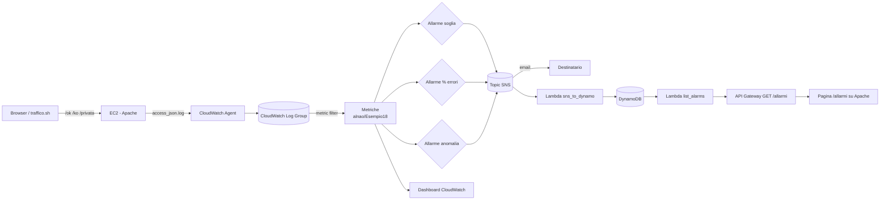

# AWS Esempio 18 - Da un errore HTTP a una notifica SNS

Un sito web su **EC2 con Apache** che espone url che rispondono bene e url che rispondono male.
Ogni richiesta finisce in un log JSON che il **CloudWatch Agent** spedisce a un **log group**; dei
**metric filter** trasformano quelle righe in metriche, tre **allarmi CloudWatch** diversi le
guardano e pubblicano su un **topic SNS**. Il topic manda la mail e, in parallelo, invoca una
**Lambda** che salva l'evento su **DynamoDB**: lo storico si consulta da una **pagina web** servita
dalla stessa EC2 che chiama un **API Gateway**.

E' l'esempio tipico della domanda *"come faccio ad accorgermi che il mio sito sta rispondendo
errori?"*: la risposta e' che il log da solo non basta, va trasformato in una **metrica** per
poterci mettere sopra un allarme.

- ⚠️ Nota importante: l'esecuzione di questi esempi nel cloud puo causare costi indesiderati ⚠️

## Architettura



## Gli url del sito

| Url | Risposta | A cosa serve |
| --- | --- | --- |
| `/ok` | `200` | Traffico buono, denominatore della percentuale di errore |
| `/ko` | `403` (o il codice scelto) | Errore **simulato**: una direttiva `Redirect 403` |
| `/privata` | `401` / `403` / `200` | Errore **vero**, da Basic Auth: vedi sotto |
| `/allarmi` | `200` | Pagina con lo storico degli allarmi letto da DynamoDB |

**La differenza fra 401 e 403** e' il motivo per cui `/privata` esiste. Il file `.htpasswd`
contiene due utenti, ma la direttiva `Require user` ne elenca uno solo:

```bash
curl -i http://<ip>/privata/                       # 401 - "chi sei?"
curl -i -u ospite:ospite18 http://<ip>/privata/    # 403 - "so chi sei, ma non puoi"
curl -i -u alnao:esempio18 http://<ip>/privata/    # 200
```

Il `401` significa *non autenticato*, il `403` *autenticato ma non autorizzato*. Su `/ko` invece il
`403` e' finto: `Redirect` con un codice diverso da `3xx` non fa un vero redirect, Apache
restituisce direttamente quello stato. Cambiando `monitored_status_code` cambiano insieme la
risposta di `/ko`, i metric filter e gli allarmi.

## Dal log alla metrica

Apache scrive di default il formato *combined*, leggibile ma scomodo da filtrare. Qui un `LogFormat`
personalizzato produce un oggetto JSON per riga:

```
{"time":"...","remote_ip":"...","method":"GET","path":"/ko","status":403,"bytes":0,...}
```

cosi' il metric filter e' `{ $.status = 403 }` invece di un pattern posizionale fragile del tipo
`[ip, id, user, ts, req, status=403, ...]`. I filtri creati sono tre:

| Filtro | Metrica | Nota |
| --- | --- | --- |
| `{ $.status = 403 }` | `Http403Count` | Con `default_value = 0`: pubblica uno zero anche quando non ci sono errori, altrimenti i grafici sarebbero pieni di buchi |
| `{ $.status = * }` | `HttpRequestCount` | Il totale, serve come denominatore |
| `{ $.status = 403 }` con dimensione `Path` | `Http403CountByPath` | Errori separati per url. Le metriche con dimensioni **non ammettono** `default_value`: la serie di un path nasce al primo errore |

## I tre allarmi

| Allarme | Come decide | Quando usarlo |
| --- | --- | --- |
| `-http-403` | `Sum >= soglia` sul conteggio | Il piu' semplice, ottimo per la demo |
| `-http-error-rate` | espressione `IF(m2 > 0, 100 * m1 / m2, 0)` | Piu' realistico: 10 errori su 10 richieste sono un incidente, 10 su centomila sono rumore. L'`IF` evita la divisione per zero |
| `-http-403-anomaly` | `ANOMALY_DETECTION_BAND` | Nessuna soglia fissa: CloudWatch impara l'andamento normale. **Non adatto a una demo veloce**, il modello ha bisogno di ore di dati |

Tutti usano `treat_missing_data = "notBreaching"` e hanno anche gli `ok_actions`, cosi' si vede pure
il rientro alla normalita'.

## Lo storico su DynamoDB

Il messaggio che CloudWatch pubblica su SNS e' un JSON tecnico e poco leggibile. La Lambda
[sns_to_dynamo.py](lambda_functions/sns_to_dynamo.py) lo interpreta e ne salva una riga sintetica su
DynamoDB, con chiave `alarm_name` + `timestamp` e un **TTL** che cancella da solo le righe vecchie.
La Lambda [list_alarms.py](lambda_functions/list_alarms.py) espone quei dati su `GET /allarmi`:
con `?alarm_name=` fa una **Query** sulla chiave di partizione, senza parametri ripiega su una
**Scan** (la tabella e' piccola e a vita breve).

La pagina [allarmi.html.tpl](website/allarmi.html.tpl) e' servita da Apache stesso con l'url
dell'API iniettato da Terraform: nessun bucket S3 in piu', ma serve il **CORS** perche' pagina e API
stanno su domini diversi.

## Dashboard e query

Vengono creati una **dashboard** con richieste, percentuale di errore e tabella degli ultimi errori,
e tre **query salvate di Logs Insights** (richieste per stato, dettaglio errori, errori per IP),
che restano nella console pronte da eseguire.

## File del progetto

| File | Contenuto |
| --- | --- |
| [user_data.sh](user_data.sh) | Apache, i quattro url, il log JSON, il CloudWatch Agent |
| [ec2.tf](ec2.tf) | Istanza, security group, ruolo IAM |
| [cloudwatch.tf](cloudwatch.tf) | Log group, metric filter, i tre allarmi, dashboard, query |
| [sns.tf](sns.tf) | Topic, policy, iscrizione email e iscrizione Lambda |
| [lambda.tf](lambda.tf) | Le due Lambda e i loro permessi |
| [dynamodb.tf](dynamodb.tf) | Tabella dello storico con TTL |
| [api_gateway.tf](api_gateway.tf) / [api_gateway_cors.tf](api_gateway_cors.tf) | `GET /allarmi` e il preflight CORS |
| [traffico.sh](traffico.sh) | Generatore di traffico per la demo |

## Configurazione ed esecuzione

```bash
cp terraform.tfvars.example terraform.tfvars   # e mettere la propria email
terraform init
terraform plan
terraform apply
```

Le variabili principali:

| Variabile | Default | Descrizione |
| --- | --- | --- |
| `monitored_status_code` | `403` | Codice restituito da `/ko` e contato dai metric filter |
| `notification_email` | `""` | Email iscritta al topic (vuoto = nessuna iscrizione) |
| `alarm_threshold` | `1` | Errori nel periodo oltre i quali scatta l'allarme a soglia |
| `alarm_period_seconds` | `60` | Ampiezza del periodo di valutazione |
| `error_rate_threshold` | `20` | Percentuale di errore dell'allarme sul rapporto |
| `enable_anomaly_alarm` | `true` | Crea anche l'allarme ad anomaly detection |
| `basic_auth_user` / `basic_auth_user_bloccato` | `alnao` / `ospite` | Utenti dell'area `/privata` |
| `ttl_days` | `30` | Giorni di conservazione delle righe su DynamoDB |
| `vpc_id` / `subnet_id` | `""` | Vuoti = VPC di default e sua prima subnet |
| `enable_ssh` | `false` | Apre la porta 22 (altrimenti solo SSM) |
| `root_volume_size` | `30` | Disco root in GB: l'AMI Amazon Linux 2023 ha uno snapshot da 30 GB, valori inferiori fanno fallire l'apply |

Dopo l'`apply` arriva una mail di **conferma dell'iscrizione SNS**: finche' non si clicca sul link
il topic non manda mail (la Lambda invece scrive su DynamoDB da subito).

## Prova

```bash
./traffico.sh -e 10 -o 5        # 10 chiamate a /ko e 5 a /ok
./traffico.sh -m privata -e 6   # alterna 401 e 403 veri sull'area protetta

terraform output url_storico_allarmi   # la pagina con lo storico
terraform output dashboard_url         # la dashboard CloudWatch

aws cloudwatch describe-alarms \
  --alarm-name-prefix "$(terraform output -raw alarm_name)" \
  --query 'MetricAlarms[].[AlarmName,StateValue]' --output table
```

Il primo avvio non e' immediato: l'`user_data` deve installare Apache e l'agent, l'agent spedisce a
gruppi ogni pochi secondi e l'allarme valuta un periodo intero. Tra la chiamata a `/ko` e la mail
passano di norma **2-4 minuti**; se dopo cinque minuti il log group e' vuoto conviene guardare
`/var/log/cloud-init-output.log` sull'istanza, raggiungibile senza aprire la porta 22:

```bash
aws ssm start-session --target "$(terraform output -raw instance_id)"
```

Per tornare in stato `OK` basta smettere di chiamare `/ko`: al periodo successivo il conteggio torna
a zero e arriva la seconda notifica, quella degli `ok_actions`.

## Pulizia

```bash
terraform destroy
```

## AlNao.it
Molti esempi presenti in questo repository sono stati creati e pubblicati sul sito [alnao.it](https://www.alnao.it/).

## License
Made with ❤️ by <a href="https://www.alnao.it">AlNao</a>
&bull;
Public projects [GNU General Public License v3.0](https://www.gnu.org/licenses/gpl-3.0.html)
