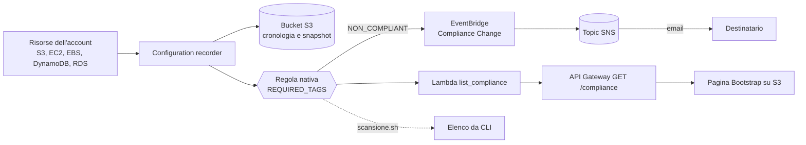

# AWS Esempio 19 - Config Tag Scanner

Quali risorse del mio account non hanno i tag obbligatori? La risposta la da' **AWS Config** con la
sua **regola nativa `REQUIRED_TAGS`**: nessuna Lambda da scrivere, si passano i nomi dei tag come
parametri e Config marca ogni risorsa come `COMPLIANT` o `NON_COMPLIANT`.

I tag verificati in questo esempio sono cinque: **`project`**, **`cost`**, **`environment`**,
**`createdWith`**, **`createdBy`**.

Oltre alla regola, il template crea un **cruscotto web** che elenca risorse conformi e non conformi
con il dettaglio dei tag mancanti, la notifica su **SNS** quando una risorsa diventa non conforme,
uno **script di scansione** da CLI e due bucket di prova, uno con tutti i tag e uno senza, per
vedere subito il risultato.

- ⚠️ Nota importante: l'esecuzione di questi esempi nel cloud puo causare costi indesiderati ⚠️

## Architettura



## Come funziona

AWS Config lavora in tre pezzi distinti, ed e' il punto che di solito confonde:

| Pezzo | Cosa fa | Risorsa Terraform |
| --- | --- | --- |
| **Configuration recorder** | Registra com'e' fatta ogni risorsa, tag compresi | `aws_config_configuration_recorder` |
| **Delivery channel** | Consegna cronologia e snapshot su un bucket S3 | `aws_config_delivery_channel` |
| **Config rule** | Valuta le risorse registrate e assegna la conformita' | `aws_config_config_rule` |

Il recorder **nasce spento**: serve `aws_config_configuration_recorder_status` per accenderlo,
altrimenti la regola esiste ma non valuta niente.

> ⚠️ **AWS ammette un solo configuration recorder per regione per account.** Se nell'account e' gia'
> attivo (Control Tower, Security Hub, un'altra baseline) il `terraform apply` fallisce con
> `MaxNumberOfConfigurationRecordersExceededException`: basta mettere `create_config_recorder = false`
> e la regola si aggancia al recorder esistente.

## La regola `REQUIRED_TAGS`

E' una **managed rule**, cioe' codice gestito da AWS. Accetta fino a **sei** coppie di parametri
`tag1Key`..`tag6Key` e `tag1Value`..`tag6Value`; il valore e' facoltativo e, dove manca, va bene
qualsiasi valore. Una risorsa e' `NON_COMPLIANT` se le manca anche un solo tag richiesto **oppure**
se il valore non e' fra quelli ammessi.

In [main.tf](main.tf) i parametri sono costruiti dalla lista `required_tag_keys`, cosi' basta
cambiare la variabile per cambiare la regola:

```json
{
  "tag1Key": "project",
  "tag2Key": "cost",
  "tag3Key": "environment",  "tag3Value": "dev,test,prod",
  "tag4Key": "createdWith",  "tag4Value": "terraform,console,cli",
  "tag5Key": "createdBy"
}
```

I valori ammessi si dichiarano nella mappa `allowed_tag_values` e diventano una stringa separata da
virgole: `environment = ["dev","test","prod"]` significa che un `environment = produzione` risulta
**non conforme anche se il tag c'e'**.

Il limite dei sei tag e' della regola nativa: per un elenco piu' lungo, o per controlli piu'
raffinati, serve una **custom rule** con una Lambda (oppure una Guard rule).

## Il cruscotto web

La pagina Bootstrap ospitata su S3 mostra tre contatori (conformi, non conformi, totale) e la
tabella delle risorse, filtrabile per stato, tipo e nome. Per ogni risorsa non conforme dice
**quali tag mancano** e quali hanno un **valore non ammesso**.

Il dato non arriva da una sola API: AWS Config tiene separate la conformita' e i tag, e la Lambda
[list_compliance.py](lambda_functions/list_compliance.py) incrocia le due cose.

| Chiamata | Cosa restituisce |
| --- | --- |
| `GetComplianceDetailsByConfigRule` | Chi e' `COMPLIANT` e chi `NON_COMPLIANT` |
| `SelectResourceConfig` | I tag di tutte le risorse, con **una sola query SQL** sullo stato registrato da Config |

`SelectResourceConfig` e' il pezzo interessante: accetta una query tipo
`SELECT resourceId, resourceType, tags` sull'inventario di Config, quindi i tag di tutte le risorse
si prendono in una chiamata invece di interrogarle una per una. E' anche il motivo per cui la pagina
riesce a dire *perche'* una risorsa non e' conforme, cosa che la regola nativa da sola non espone.

```bash
terraform output website_url   # il cruscotto
terraform output api_url       # l'endpoint JSON, comodo da chiamare con curl
```

## Costi e ambito

Config si paga **per elemento di configurazione registrato** e per **valutazione di regola**: su un
account pieno di risorse che cambiano spesso non e' gratis. Per questo il default e'
`record_all_resources = false` con un elenco ristretto di tipi in `recorded_resource_types`;
mettendolo a `true` si inventaria tutto quello che Config supporta.

La regola valuta i tipi elencati in `compliance_resource_types`: devono essere fra quelli
**registrati dal recorder** e fra quelli **supportati da `REQUIRED_TAGS`** (S3, EC2, EBS, DynamoDB,
RDS, ELB, ASG, CloudFormation e pochi altri; non tutti i servizi AWS ci sono).

## File del progetto

| File | Contenuto |
| --- | --- |
| [config.tf](config.tf) | Ruolo IAM, recorder, delivery channel e la regola `REQUIRED_TAGS` |
| [s3.tf](s3.tf) | Bucket di consegna con la bucket policy richiesta da Config |
| [sns.tf](sns.tf) | Topic SNS e regola EventBridge sui passaggi a `NON_COMPLIANT` |
| [demo.tf](demo.tf) | Due bucket di prova, uno conforme e uno no |
| [lambda.tf](lambda.tf) | Lambda di lettura e permessi di sola lettura su Config |
| [api_gateway.tf](api_gateway.tf) | `GET /compliance` e il preflight CORS |
| [website.tf](website.tf) / [website/](website/) | Bucket del sito e pagina Bootstrap |
| [scansione.sh](scansione.sh) | Elenco delle risorse non conformi da CLI |

## Configurazione ed esecuzione

```bash
cp terraform.tfvars.example terraform.tfvars   # e mettere la propria email
terraform init
terraform plan
terraform apply
```

Le variabili principali:

| Variabile | Default | Descrizione |
| --- | --- | --- |
| `required_tag_keys` | i cinque tag | Tag obbligatori, massimo sei |
| `allowed_tag_values` | `environment`, `createdWith` | Valori ammessi per singolo tag |
| `create_config_recorder` | `true` | Mettere `false` se il recorder esiste gia' nella regione |
| `record_all_resources` | `false` | `true` inventaria tutti i tipi supportati (costa di piu') |
| `recorded_resource_types` | 7 tipi | Cosa registra il recorder |
| `compliance_resource_types` | 5 tipi | Cosa valuta la regola |
| `notification_email` | `""` | Email iscritta al topic SNS |
| `create_demo_resources` | `true` | Crea i due bucket di prova |
| `stage_name` | `dev` | Stage dell'API Gateway |
| `cors_allowed_origin` | `*` | Origine autorizzata a chiamare l'API |

Dopo l'`apply` arriva la mail di **conferma dell'iscrizione SNS**, da confermare per ricevere le
notifiche.

## Prova

La prima valutazione non e' immediata: Config deve registrare le risorse e poi valutarle, servono
**dai cinque ai quindici minuti**. Per non aspettare si puo' forzare:

```bash
terraform output website_url   # il cruscotto web
./scansione.sh -v              # forza la valutazione e poi elenca da CLI
./scansione.sh -t              # elenca mostrando quali tag mancano
terraform output console_url   # la stessa cosa dalla console AWS
```

Uscita tipica:

```
Regola:        alnao-dev-terraform-esempio19-required-tags
Tag richiesti: project,cost,environment,createdWith,createdBy

=== Risorse NON conformi ===
TIPO                         RISORSA
AWS::S3::Bucket              alnao-dev-terraform-esempio19-demo-ko-123456789012
      tag mancanti: cost createdWith createdBy
```

Per vedere il ciclo completo basta aggiungere i tag mancanti al bucket e rilanciare la scansione:

```bash
aws s3api put-bucket-tagging \
  --bucket "$(terraform output -raw demo_bucket_non_compliant)" \
  --tagging 'TagSet=[{Key=project,Value=esempio19},{Key=cost,Value=formazione},{Key=environment,Value=dev},{Key=createdWith,Value=cli},{Key=createdBy,Value=alnao}]'

./scansione.sh -v
```

## Quanto costa

Config si paga **per configuration item registrato** ($0,003 con il recording continuo) e **per
valutazione di regola** ($0,001 le prime centomila al mese). Non ci sono costi fissi: il conto
dipende da quanti *cambiamenti* avvengono, non da quanto tempo il servizio resta acceso.

Su un account con un centinaio di risorse:

| Scenario | Costo |
| --- | --- |
| Provarlo un giorno e poi fare `destroy` | **circa $0,60** (quasi tutto e' l'inventario iniziale, una tantum) |
| Tenerlo acceso un mese, con qualche decina di risorse create e distrutte | **circa $1,30** |

Attenzione al **periodic recording** ($0,012 per CI, uno al giorno per risorsa): sembra piu'
economico ma su cento risorse ferme costa $36 al mese contro meno di un dollaro del continuo.
Conviene solo con moltissime risorse che cambiano di continuo.

Lambda, API Gateway e il bucket del sito, a questi volumi, restano nell'ordine dei centesimi.

## Idee per estenderlo

- **Remediation automatica**: `aws_config_remediation_configuration` con l'automation SSM
  `AWS-SetRequiredTags` per applicare i tag mancanti invece di limitarsi a segnalarli.
- **Conformance pack**: raggruppare questa regola con altre in un unico pacchetto versionato.
- **Custom rule** con Lambda per superare il limite dei sei tag o per regole diverse per tipo di risorsa.
- **Aggregator multi-account** per una vista unica su tutta l'organizzazione.
- **Config + Cost Explorer**: il tag `cost` diventa utile davvero quando e' attivato come
  *cost allocation tag* nella console di fatturazione.

## Pulizia

```bash
terraform destroy
```

Il bucket di Config contiene gli snapshot: il `destroy` funziona grazie a `force_destroy = true`.

## AlNao.it
Molti esempi presenti in questo repository sono stati creati e pubblicati sul sito [alnao.it](https://www.alnao.it/).

## License
Made with ❤️ by <a href="https://www.alnao.it">AlNao</a>
&bull;
Public projects [GNU General Public License v3.0](https://www.gnu.org/licenses/gpl-3.0.html)
