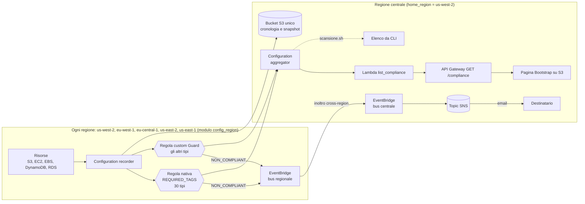

# AWS Esempio 19 - Config Tag Scanner

Quali risorse del mio account non hanno i tag obbligatori? La risposta la da' **AWS Config** con la
sua **regola nativa `REQUIRED_TAGS`**: nessuna Lambda da scrivere, si passano i nomi dei tag come
parametri e Config marca ogni risorsa come `COMPLIANT` o `NON_COMPLIANT`.

I tag verificati in questo esempio sono cinque: **`project`**, **`cost`**, **`environment`**,
**`createdWith`**, **`createdBy`**.

La regola nativa conosce solo 30 tipi di risorsa: per tutti gli altri (Lambda, SNS, SQS, API Gateway,
ECS, EKS, KMS...) il template affianca una **regola custom in CloudFormation Guard**, sempre senza
codice, generata dagli stessi tag.

Config e' un servizio **regionale**, quindi l'esempio e' **multi-regione**: recorder e regola vengono
creati in ognuna delle regioni scelte (default **Oregon, Irlanda, Francoforte, Ohio, N. Virginia**) e un
**configuration aggregator** nella regione centrale li riunisce in una vista unica.

Oltre alla regola, il template crea un **cruscotto web** che elenca risorse conformi e non conformi
di tutte le regioni con il dettaglio dei tag mancanti, la notifica su **SNS** quando una risorsa
diventa non conforme, uno **script di scansione** da CLI e due bucket di prova per regione, uno con
tutti i tag e uno senza, per vedere subito il risultato.

- ⚠️ Nota importante: l'esecuzione di questi esempi nel cloud puo causare costi indesiderati ⚠️

## Architettura



## Come funziona

AWS Config lavora in tre pezzi distinti, ed e' il punto che di solito confonde:

| Pezzo | Cosa fa | Risorsa Terraform |
| --- | --- | --- |
| **Configuration recorder** | Registra com'e' fatta ogni risorsa, tag compresi | `aws_config_configuration_recorder` |
| **Delivery channel** | Consegna cronologia e snapshot su un bucket S3 | `aws_config_delivery_channel` |
| **Config rule** | Valuta le risorse registrate e assegna la conformita' | `aws_config_config_rule` |
| **Configuration aggregator** | Riunisce le valutazioni di piu' regioni (e account) in una vista unica | `aws_config_configuration_aggregator` |

I primi tre sono **regionali** e stanno nel modulo [modules/config_region](modules/config_region/);
l'aggregator e' uno solo, nella regione centrale.

Il recorder **nasce spento**: serve `aws_config_configuration_recorder_status` per accenderlo,
altrimenti la regola esiste ma non valuta niente.

> ⚠️ **AWS ammette un solo configuration recorder per regione per account.** Se in una regione e'
> gia' attivo (Control Tower, Security Hub, un'altra baseline) il `terraform apply` fallisce con
> `MaxNumberOfConfigurationRecordersExceededException`: basta elencare quella regione in
> `regions_with_existing_recorder` e li' il modulo crea solo la regola, agganciata al recorder esistente.

## Multi-regione

Terraform **non sa creare provider in un ciclo**: per questo le regioni ammesse sono cinque,
fissate in [main.tf](main.tf) con un `provider "aws"` con alias ciascuna, e la variabile `regions`
decide quali dei cinque blocchi `module` in [config.tf](config.tf) vengono istanziati (`count`).
Per aggiungere una sesta regione vanno aggiunti un provider e un blocco module, piu' la regione
nelle `validation` di `regions` e `home_region`.

Le impostazioni comuni (ruolo, bucket, tipi di risorsa, parametri della regola...) sono costruite
una volta sola nella local `region_settings` e passate identiche a ogni modulo: il nome della
regola e' **lo stesso in tutte le regioni**, cosi' l'aggregator, la Lambda e lo script la cercano
con una chiave sola.

Cosa resta nella regione centrale (`home_region`, default Oregon) e perche':

| Cosa | Perche' una sola |
| --- | --- |
| Ruolo IAM di Config | IAM e' globale, lo stesso ruolo serve a tutti i recorder |
| Bucket di consegna | Config scrive sotto `AWSLogs/<account>/Config/<regione>/`, le regioni non si pestano |
| Aggregator | E' proprio il suo mestiere: copia le valutazioni di tutte le regioni in un punto solo |
| SNS + regola EventBridge | SNS non puo' essere bersaglio cross-region; le altre regioni **inoltrano** l'evento al bus centrale |
| Lambda, API, sito | Leggono dall'aggregator con le API `*Aggregate*` |

L'inoltro degli eventi e' il pezzo meno ovvio: Config pubblica `Config Rules Compliance Change` sul
bus di default **della regione della risorsa**. In ogni regione non centrale una regola EventBridge
prende i `NON_COMPLIANT` e li manda, con un ruolo che ha `events:PutEvents`, al bus di default della
regione centrale; li' la regola in [sns.tf](sns.tf) li gira su SNS insieme a quelli locali. Nello
stesso account non serve nessuna policy sul bus di destinazione.

L'aggregator **non e' istantaneo**: copia i risultati dalle regioni con qualche minuto di ritardo
rispetto alla valutazione, e per lo stesso account non richiede autorizzazioni. Per estenderlo a piu'
account si aggiunge una `organization_aggregation_source` (o si autorizza ogni account con
`aws_config_aggregate_authorization`), il resto della catena non cambia.

## La regola `REQUIRED_TAGS`

E' una **managed rule**, cioe' codice gestito da AWS. Accetta fino a **sei** coppie di parametri
`tag1Key`..`tag6Key` e `tag1Value`..`tag6Value`; il valore e' facoltativo e, dove manca, va bene
qualsiasi valore. Una risorsa e' `NON_COMPLIANT` se le manca anche un solo tag richiesto **oppure**
se il valore non e' fra quelli ammessi.

In [main.tf](main.tf) i parametri sono costruiti dalla lista `required_tag_keys`, cosi' basta
cambiare la variabile per cambiare la regola:

```json
{
  "tag1Key": "project",
  "tag2Key": "cost",
  "tag3Key": "environment",  "tag3Value": "dev,test,prod",
  "tag4Key": "createdWith",  "tag4Value": "terraform,console,cli",
  "tag5Key": "createdBy"
}
```

I valori ammessi si dichiarano nella mappa `allowed_tag_values` e diventano una stringa separata da
virgole: `environment = ["dev","test","prod"]` significa che un `environment = produzione` risulta
**non conforme anche se il tag c'e'**.

Il limite dei sei tag e' della regola nativa: per un elenco piu' lungo, o per controlli piu'
raffinati, serve una **custom rule**, come quella del paragrafo seguente.

## La regola custom in Guard

`REQUIRED_TAGS` valuta 30 tipi e basta. Per gli altri Config offre le **Custom Policy rules**: una
policy scritta nel linguaggio di [CloudFormation Guard](https://docs.aws.amazon.com/cfn-guard/latest/ug/writing-rules.html)
che Config esegue da solo sul *configuration item* di ogni risorsa. Rispetto a una custom rule con
Lambda non c'e' codice da scrivere ne' una funzione da deployare in ogni regione.

La policy e' in [required_tags.guard.tpl](required_tags.guard.tpl) e Terraform la genera dalle stesse
variabili della regola nativa (`required_tag_keys`, `allowed_tag_values`):

```
rule tag_obbligatori {
    tags.project exists <<manca il tag project>>
    tags.cost exists <<manca il tag cost>>
    tags.environment exists <<manca il tag environment>>
    tags.environment IN ["dev", "test", "prod"] <<environment deve essere uno fra dev, test, prod>>
    ...
}
```

`tags` e' la mappa dei tag che Config registra nel configuration item; ogni clausola che fallisce
rende la risorsa `NON_COMPLIANT` e il messaggio fra `<< >>` finisce nell'annotazione della
valutazione. Il testo generato si legge con `terraform output custom_rule_policy`.

### Chiavi case-insensitive

Le chiavi dei tag in AWS sono **case-sensitive**: `Project` e `project` sono due tag diversi, e
`REQUIRED_TAGS` non ha modo di trattarli come uno solo. La regola Guard invece puo': con
`tag_keys_case_insensitive = true` (default) Terraform genera per ogni chiave le varianti
minuscola, con iniziale maiuscola e tutta maiuscola, in `OR` sulla stessa riga:

```
tags.project exists OR tags.Project exists OR tags.PROJECT exists <<manca il tag project>>
tags.createdWith exists OR tags.createdwith exists OR tags.CreatedWith exists OR tags.CREATEDWITH exists <<manca il tag createdWith>>
```

Sono varianti fisse (originale, `lower`, `title`, `upper`), non una regex: `Created_With` o
`createdwith ` con lo spazio restano fuori. Vale **solo per la regola Guard**:
un bucket con `Project` resta non conforme per la nativa. Per avere la tolleranza su tutte le
risorse c'e' `custom_rule_only = true`: la nativa non viene creata e i suoi 30 tipi passano nello
scope della Guard. Si perde la regola "senza codice" ma si guadagna un criterio solo per tutto.

L'alternativa pulita resta rinominare i tag sulle risorse: `Project` diverso da `project` e' un
problema anche per Cost Explorer e per i cost allocation tag.

Due scelte da conoscere:

- **Lo scope e' obbligatorio.** Senza, la policy girerebbe su *ogni* tipo registrato, compresi quelli
  che non possono avere tag, e li marcherebbe tutti non conformi. La lista e' in
  `custom_rule_resource_types` (una cinquantina di tipi taggabili non coperti da `REQUIRED_TAGS`,
  massimo 100): si aggiunge quello che manca, si toglie quello che non interessa.
- **Le due regole hanno tipi disgiunti**, quindi i risultati si sommano senza doppioni. Lambda, script
  ed EventBridge le cercano entrambe (`terraform output config_rule_names`); con
  `enable_custom_rule = false` resta solo la nativa.

I tipi **globali** (IAM, CloudFront, Route 53) non sono registrati perche' il recorder ha
`include_global_resource_types = false`: in un template multi-regione andrebbero registrati in una
regione sola, altrimenti ogni regione li conta di nuovo.

## Il cruscotto web

La pagina Bootstrap ospitata su S3 mostra tre contatori (conformi, non conformi, totale), un
riquadro per regione e la tabella delle risorse, filtrabile per stato, regione, tipo e nome. Per
ogni risorsa non conforme dice **quali tag mancano** e quali hanno un **valore non ammesso**.

Il dato non arriva da una sola API: AWS Config tiene separate la conformita' e i tag, e la Lambda
[list_compliance.py](lambda_functions/list_compliance.py) incrocia le due cose leggendo
dall'**aggregator**, quindi tutte le regioni insieme.

| Chiamata | Cosa restituisce |
| --- | --- |
| `GetAggregateComplianceDetailsByConfigRule` | Chi e' `COMPLIANT` e chi `NON_COMPLIANT`; vuole account e regione, quindi una chiamata per regione |
| `SelectAggregateResourceConfig` | I tag di tutte le risorse di tutte le regioni, con **una sola query SQL** sull'aggregator |

`SelectAggregateResourceConfig` e' il pezzo interessante: accetta una query tipo
`SELECT resourceId, resourceType, awsRegion, tags` sull'inventario aggregato, quindi i tag di tutte
le risorse, ovunque stiano, si prendono in una chiamata invece di interrogarle una per una. E' anche
il motivo per cui la pagina riesce a dire *perche'* una risorsa non e' conforme, cosa che la regola
nativa da sola non espone.

```bash
terraform output website_url   # il cruscotto
terraform output api_url       # l'endpoint JSON, comodo da chiamare con curl
```

## Costi e ambito

Il default e' la copertura massima delle due regole al costo minimo: `record_all_resources = false`
con `recorded_resource_types = []`, cioe' il recorder registra **esattamente i tipi che le regole
valutano** (i 30 di `REQUIRED_TAGS` piu' quelli della Guard) e niente altro, e
`compliance_resource_types = []` (nessuno scope: la nativa valuta **tutti i 30 tipi** che sa gestire).

Con `record_all_resources = true` il recorder passa alla strategia **a esclusione**: inventaria tutto
quello che Config supporta (centinaia di tipi: ENI, DHCP options, SSM inventory...) tranne
`excluded_resource_types`. Il default esclude:

- `AWS::Config::ResourceCompliance`: e' l'**esito delle valutazioni** registrato come risorsa. Costa un
  CI ($0,003) a ogni cambio di stato di conformita', cioe' triplica il costo di ogni valutazione, e
  non serve a nulla per i tag. E' il costo nascosto piu' comune di Config.
- `AWS::IAM::Group/Policy/Role/User`: tipi globali. Con la strategia a esclusione verrebbero
  registrati in **ogni** regione e pagati cinque volte; la regola nativa comunque non li valuta.

I 30 tipi sono: ACM Certificate, Auto Scaling Group, CloudFormation Stack, CodeBuild Project,
DynamoDB Table, EC2 (Instance, Volume, VPC, Subnet, Security Group, Network Interface, Route Table,
Network ACL, Internet Gateway, Customer Gateway, VPN Connection, VPN Gateway), ELB classic e v2,
RDS (DBInstance, DBSnapshot, DBSubnetGroup, DBSecurityGroup, EventSubscription), Redshift (Cluster,
Snapshot, ParameterGroup, SecurityGroup, SubnetGroup) e S3 Bucket; l'elenco e' nella local
`required_tags_supported_types` di [variables.tf](variables.tf).

> ⚠️ **Lambda, SNS, SQS, API Gateway, IAM, EKS, ECS, CloudWatch e molti altri NON sono valutati**
> dalla regola nativa, anche se il recorder li registra: e' un limite di `REQUIRED_TAGS`. Per questo
> c'e' la regola custom Guard, che copre i tipi in `custom_rule_resource_types`.

Config si paga **per elemento di configurazione registrato** e per **valutazione di regola**: su un
account pieno di risorse che cambiano spesso non e' gratis. `record_all_resources = true` serve
solo se si vuole l'inventario completo per altri scopi (audit, cronologia): per i tag non aggiunge
niente, perche' i tipi in piu' non sono valutati da nessuna delle due regole.

## File del progetto

| File | Contenuto |
| --- | --- |
| [main.tf](main.tf) | Provider centrale piu' uno con alias per regione, locals comuni |
| [config.tf](config.tf) | Ruolo IAM di Config, le impostazioni comuni, un blocco `module` per regione e l'aggregator |
| [modules/config_region/](modules/config_region/) | Recorder, delivery channel, regola `REQUIRED_TAGS`, regola custom Guard, inoltro eventi e bucket di prova di UNA regione |
| [required_tags.guard.tpl](required_tags.guard.tpl) | Policy Guard della regola custom, generata dai tag richiesti |
| [s3.tf](s3.tf) | Bucket di consegna unico con la bucket policy richiesta da Config |
| [sns.tf](sns.tf) | Topic SNS, ruolo per l'inoltro cross-region e regola EventBridge centrale sui `NON_COMPLIANT` |
| [lambda.tf](lambda.tf) | Lambda di lettura e permessi di sola lettura su Config |
| [api_gateway.tf](api_gateway.tf) | `GET /compliance` e il preflight CORS |
| [website.tf](website.tf) / [website/](website/) | Bucket del sito e pagina Bootstrap |
| [scansione.sh](scansione.sh) | Elenco delle risorse non conformi da CLI |

## Configurazione ed esecuzione

```bash
cp terraform.tfvars.example terraform.tfvars   # e mettere la propria email
terraform init
terraform plan
terraform apply
```

Le variabili principali:

| Variabile | Default | Descrizione |
| --- | --- | --- |
| `regions` | Oregon, Irlanda, Francoforte, Ohio, N. Virginia | Regioni controllate; ammesse solo queste cinque |
| `home_region` | `us-west-2` | Regione centrale: bucket, aggregator, SNS, Lambda, API, sito |
| `tags` | i cinque tag dell'esempio | Tag applicati a ogni risorsa creata: `project`, `cost`, `environment`, `createdWith`, `createdBy` |
| `required_tag_keys` | i cinque tag | Tag obbligatori, massimo sei |
| `allowed_tag_values` | `environment`, `createdWith` | Valori ammessi per singolo tag |
| `regions_with_existing_recorder` | `[]` | Regioni in cui il recorder esiste gia': li' si crea solo la regola |
| `record_all_resources` | `false` | `true` = il recorder inventaria tutti i tipi supportati da Config tranne `excluded_resource_types` (costa di piu') |
| `excluded_resource_types` | `ResourceCompliance` + IAM | Tipi esclusi quando `record_all_resources = true` |
| `recorded_resource_types` | `[]` = i tipi valutati dalle due regole | Cosa registra il recorder quando `record_all_resources = false` |
| `compliance_resource_types` | `[]` = tutti i 30 tipi | Cosa valuta la regola nativa |
| `enable_custom_rule` | `true` | Crea anche la regola custom Guard |
| `tag_keys_case_insensitive` | `true` | La regola Guard accetta `project`, `Project`, `PROJECT` |
| `custom_rule_only` | `false` | Solo la regola Guard, anche per i 30 tipi della nativa |
| `custom_rule_resource_types` | ~50 tipi | Cosa valuta la regola custom (massimo 70, +30 con `custom_rule_only`) |
| `notification_email` | `""` | Email iscritta al topic SNS |
| `create_demo_resources` | `true` | Crea i due bucket di prova in ogni regione |
| `stage_name` | `dev` | Stage dell'API Gateway |
| `cors_allowed_origin` | `*` | Origine autorizzata a chiamare l'API |

Dopo l'`apply` arriva la mail di **conferma dell'iscrizione SNS**, da confermare per ricevere le
notifiche.

## Prova

La prima valutazione non e' immediata: Config deve registrare le risorse e poi valutarle, servono
**dai cinque ai quindici minuti**, piu' qualche minuto perche' l'aggregator copi i risultati dalle
regioni. Per non aspettare si puo' forzare:

```bash
terraform output website_url             # il cruscotto web, tutte le regioni
./scansione.sh -v                        # forza la valutazione ovunque e poi elenca da CLI
./scansione.sh -t                        # elenca mostrando quali tag mancano
./scansione.sh -g us-east-2              # una regione sola
terraform output aggregator_console_url  # la vista aggregata dalla console AWS
terraform output console_urls            # la regola, regione per regione
```

Uscita tipica:

```
Regole:        alnao-terraform-esempio19-required-tags alnao-terraform-esempio19-required-tags-custom
Aggregator:    alnao-terraform-esempio19-aggregator
Regioni:       us-west-2 eu-west-1 eu-central-1 us-east-2 us-east-1
Tag richiesti: project,cost,environment,createdWith,createdBy

=== Risorse NON conformi ===

--- us-west-2 ---
TIPO                         RISORSA
AWS::S3::Bucket              alnao-terraform-esempio19-demo-ko-uswest2-123456789012
      tag mancanti: cost createdWith createdBy
AWS::Lambda::Function        vecchia-funzione-senza-tag
      tag mancanti: project cost environment createdWith createdBy

--- eu-west-1 ---
TIPO                         RISORSA
AWS::S3::Bucket              alnao-terraform-esempio19-demo-ko-euwest1-123456789012
      tag mancanti: cost createdWith createdBy
...
=== Riepilogo ===
Risorse non conformi in tutte le regioni: 5
```

Per vedere il ciclo completo basta aggiungere i tag mancanti a uno dei bucket e rilanciare la
scansione: la notifica SNS arriva anche per le regioni non centrali, grazie all'inoltro.

```bash
aws s3api put-bucket-tagging --region us-east-2 \
  --bucket "$(terraform output -json demo_buckets_non_compliant | jq -r '."us-east-2"')" \
  --tagging 'TagSet=[{Key=project,Value=alnao-terraform-esempio19},{Key=cost,Value=tagScanner},{Key=environment,Value=prod},{Key=createdWith,Value=cli},{Key=createdBy,Value=alnao}]'

./scansione.sh -v
```

## Quanto costa

Config si paga **per configuration item registrato** ($0,003 con il recording continuo) e **per
valutazione di regola** ($0,001 le prime centomila al mese). Non ci sono costi fissi: il conto
dipende da quanti *cambiamenti* avvengono, non da quanto tempo il servizio resta acceso.

Su un account con un centinaio di risorse **in totale** nelle cinque regioni, con i default
(recorder sui soli tipi valutati, due regole, `ResourceCompliance` non registrato):

| Scenario | Costo |
| --- | --- |
| Provarlo un giorno e poi fare `destroy` | **circa $0,50** (inventario iniziale + una valutazione per risorsa, una tantum) |
| Tenerlo acceso un mese, con qualche decina di risorse create e distrutte | **circa $1,20** |
| Come sopra ma con `record_all_resources = true` | circa il doppio: entrano ENI, subnet, route table... che nessuna regola guarda |

Ogni `apply` che modifica una regola (scope, policy Guard, parametri) fa rivalutare tutte le risorse
in scope: $0,001 l'una, quindi centesimi.

Il conto non dipende dal numero di regioni ma dal numero di risorse registrate: cinque regioni con
20 risorse l'una costano come una con 100. Quello che si moltiplica e' l'inventario iniziale delle
risorse create dal template (due bucket di prova per regione) e le valutazioni: pochi centesimi.
L'aggregator e' gratuito, l'inoltro EventBridge tra regioni si paga $1 per milione di eventi.

Attenzione al **periodic recording** ($0,012 per CI, uno al giorno per risorsa): sembra piu'
economico ma su cento risorse ferme costa $36 al mese contro meno di un dollaro del continuo.
Conviene solo con moltissime risorse che cambiano di continuo.

Lambda, API Gateway e il bucket del sito, a questi volumi, restano nell'ordine dei centesimi.

## Idee per estenderlo

- **Remediation automatica**: `aws_config_remediation_configuration` con l'automation SSM
  `AWS-SetRequiredTags` per applicare i tag mancanti invece di limitarsi a segnalarli.
- **Conformance pack**: raggruppare questa regola con altre in un unico pacchetto versionato.
- **Custom rule con Lambda** al posto della Guard, quando serve logica che una policy non sa
  esprimere (tag diversi per tipo di risorsa, controlli sul formato dei valori, eccezioni).
- **Risorse globali**: registrare IAM, CloudFront e Route 53 in una regione sola
  (`include_global_resource_types = true` solo li') e aggiungerle allo scope della regola custom.
- **Aggregator multi-account**: `organization_aggregation_source` al posto di `account_aggregation_source`
  per una vista unica su tutta l'organizzazione; Lambda e script gia' ragionano per account e regione.
- **Provider dinamici**: OpenTofu supporta `for_each` sui provider, cosi' `regions` potrebbe accettare
  qualsiasi regione senza i quattro blocchi fissi.
- **Config + Cost Explorer**: il tag `cost` diventa utile davvero quando e' attivato come
  *cost allocation tag* nella console di fatturazione.

## Pulizia

```bash
terraform destroy
```

Il bucket di Config contiene gli snapshot: il `destroy` funziona grazie a `force_destroy = true`.
Il `destroy` spegne e cancella il recorder in ogni regione, ma Config **conserva la cronologia**
gia' registrata per un po': ricreando l'esempio la prima valutazione puo' essere piu' veloce.

## AlNao.it
Molti esempi presenti in questo repository sono stati creati e pubblicati sul sito [alnao.it](https://www.alnao.it/).

## License
Made with ❤️ by <a href="https://www.alnao.it">AlNao</a>
&bull;
Public projects [GNU General Public License v3.0](https://www.gnu.org/licenses/gpl-3.0.html)
